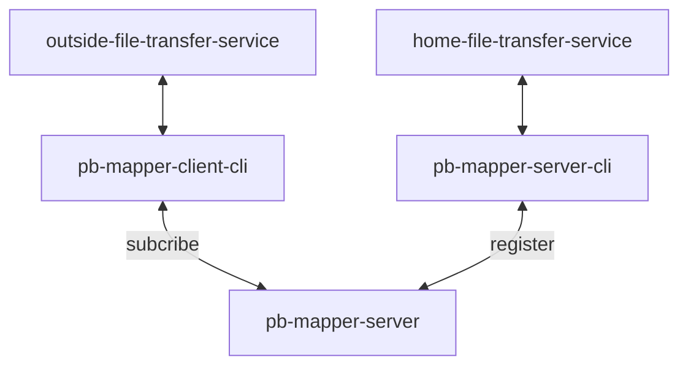

# pb-mapper
## What is `pb-mapper`?
In order to utilize my existing public servers, I wrote this tool that exposes local services to clients over the public network. That is `pb-mapper`.

For example:
Let's say you have a file transfer service running on your home computer, and you can expose that service to the public network via `pb-mapper-server-cli`. When you are working outside, you can subscribe to your home file transfer service via `pb-mapper-client-cli`, which will emulate the same file transfer service locally, and you can just use the service as you would use file transfer at home.

The graphical description is as follows:

## Todos
- [x] Public server handler: used to deploy to public network. The role is to provide `server-side` registration and `client-side` subscription to the client's local machine
- [x] Local server handler: used to map local server to a public service [TCP]
- [x] Local server handler: used to map local server to a public service [UDP]
- [x] Local client handler: Get the services that have been mapped to the public server [TCP]
- [x] Local client handler: Get the services that have been mapped to the public server [UDP]
- [x] Show remote server status: Displays the current operational status of the public server, such as the assigned conn_id, and the keys of the registered servers
- [x] Latency testing: Test the latency of the server that is mapped locally to complete the entire request
- [ ] Check for key existence before `client-side-cli` connection is started
- [ ] Github CI/CD
- [x] Docker deployment
- [ ] Adding Documentation and Notes: such as `#![deny(missing_docs, rustdoc::broken_intra_doc_links)]` 