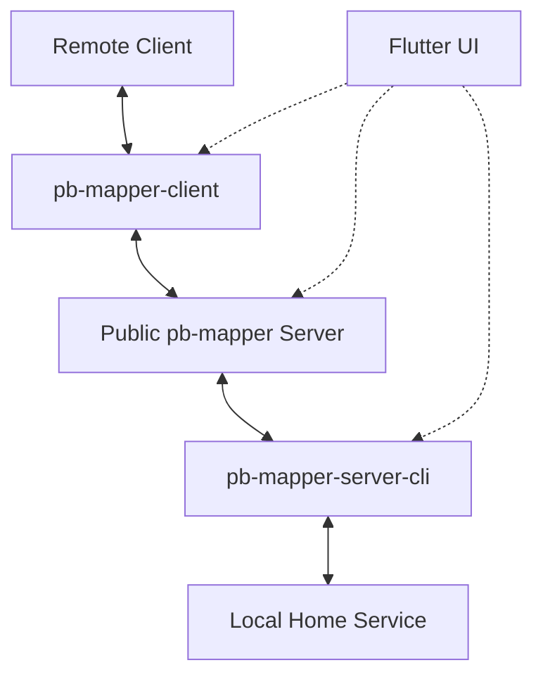

# pb-mapper

A Rust-based network tunneling/proxy system with cross-platform GUI that allows exposing local services to clients over a public network.

## What is `pb-mapper`?

pb-mapper enables you to access your home services (like file transfer servers, databases, web services) from anywhere by creating secure tunnels through a public server. The system consists of a central server, local service registration tools, client connection tools, and a modern Flutter-based GUI.

**Example Use Case:**
You have a file transfer service running on your home computer. Using pb-mapper, you can:
1. Register your local service with a public pb-mapper server using the GUI or CLI
2. When working remotely, connect to your home service through the same public server
3. Access your home file transfer service as if you were on your local network



## Features

### Core Networking
- **Full TCP/UDP Support**: Handle both TCP and UDP protocols seamlessly
- **Encryption**: Optional end-to-end encryption using the ring cryptography library
- **NAT Traversal**: Access services behind firewalls and NAT devices
- **Keep-Alive**: Configurable TCP keep-alive for connection stability
- **Multi-Platform**: Linux, macOS, Windows, Android, iOS support

### Modern GUI Interface
- **Cross-Platform UI**: Flutter-based interface for desktop and mobile
- **Responsive Design**: Adaptive layout for different screen sizes
  - **Desktop**: Left sidebar navigation with multi-column layouts
  - **Mobile**: Bottom navigation with touch-friendly interface
- **Real-Time Monitoring**: Live status updates and log streaming
- **Comprehensive Management**: All CLI functionality available through GUI

### Service Management
- **Dynamic Registration**: Real-time service registration and discovery
- **Status Monitoring**: Health checks and connection statistics
- **Configuration Profiles**: Save and load different setups
- **Log Management**: Integrated log viewer with filtering and export

## Architecture

### Components

1. **pb-mapper-server** (`src/bin/pb-mapper-server.rs`)
   - Central server managing connections between local services and clients
   - Runs on port 7666 by default with IPv4/IPv6 support
   - Handles service registration, client subscription, and connection forwarding

2. **pb-mapper-server-cli** (`src/bin/pb-mapper-server-cli.rs`)
   - Registers local TCP/UDP services with the central server
   - Supports encryption and configurable keep-alive settings
   - Environment variable configuration support

3. **pb-mapper-client-cli** (`src/bin/pb-mapper-client-cli.rs`)
   - Connects to registered remote services through the central server
   - Creates local listening endpoints for remote service access
   - Status checking and connection management capabilities

4. **Flutter GUI** (`ui/`)
   - Modern cross-platform interface built with Flutter and Rinf framework
   - Replaces all CLI functionality with user-friendly graphical interface
   - Real-time status monitoring and log management

### Project Structure

```
pb-mapper/
├── src/                    # Rust backend
│   ├── bin/               # Binary executables
│   ├── pb_server/         # Central server implementation
│   ├── local/             # Local service handlers
│   ├── common/            # Shared protocols and utilities
│   └── utils/             # Helper functions
├── ui/                    # Flutter frontend
│   ├── lib/               # Flutter application
│   ├── native/hub/        # Rust-Flutter bridge (Rinf)
│   └── documentation/     # Framework documentation
├── docker/                # Docker deployment
├── examples/              # Usage examples
└── tests/                 # Integration tests
```

## Getting Started

### Using the GUI (Recommended)

1. **Build and run the Flutter UI:**
   ```bash
   cd ui
   flutter run
   ```

2. **Use the interface to:**
   - Start/stop the central server
   - Register local services for external access
   - Connect to remote services through the server
   - Monitor connections and view real-time logs

### Using CLI Tools

1. **Start the central server:**
   ```bash
   cargo run --bin pb-mapper-server -- --port 7666
   ```

2. **Register a local service:**
   ```bash
   cargo run --bin pb-mapper-server-cli -- --service-key "my-service" --local-addr "127.0.0.1:8080" --server-addr "your-server:7666"
   ```

3. **Connect to a remote service:**
   ```bash
   cargo run --bin pb-mapper-client-cli -- --service-key "my-service" --local-addr "127.0.0.1:9090" --server-addr "your-server:7666"
   ```

## Development Status

### Completed Features
- [x] **Core Networking**: TCP/UDP protocol support with encryption
- [x] **Central Server**: Connection management and service registration
- [x] **Local Service Registration**: Expose local services to public network
- [x] **Client Connection**: Access remote services through public server
- [x] **Status Monitoring**: Real-time server and connection status
- [x] **Flutter GUI**: Complete graphical interface with responsive design
- [x] **Rinf Integration**: Seamless Rust-Flutter communication
- [x] **Cross-Platform UI**: Desktop and mobile adaptive layouts
- [x] **Log Management**: Comprehensive logging with filtering and export
- [x] **Docker Support**: Containerized deployment options
- [x] **Configuration Management**: Environment variables and settings persistence

### In Progress
- [ ] **Enhanced Documentation**: API docs and deployment guides
- [ ] **GitHub CI/CD**: Automated testing and release pipelines
- [ ] **Performance Optimization**: Connection pooling and bandwidth management

### Planned Features
- [ ] **Service Discovery**: Automatic service detection and configuration
- [ ] **Load Balancing**: Multiple instance support for high availability
- [ ] **Metrics Dashboard**: Advanced analytics and performance monitoring
- [ ] **Plugin System**: Extensible architecture for custom protocols

## Deployment

### Docker Deployment
```bash
# Build Docker images
make release-pb-mapper-server-docker-image

# Run with docker-compose
docker-compose -f docker/docker-compose.yml up
```

### System Service (Linux)
```bash
# Install systemd service files
sudo cp services/*.service /etc/systemd/system/
sudo systemctl enable pb-mapper-server
sudo systemctl start pb-mapper-server
```

## Environment Variables

- `PB_MAPPER_SERVER`: Default remote server address
- `PB_MAPPER_KEEP_ALIVE`: Enable TCP keep-alive ("ON" to enable)
- `RUST_LOG`: Logging level configuration

## Technology Stack

- **Backend**: Rust with Tokio async runtime
- **Frontend**: Flutter with Material Design
- **Bridge**: Rinf framework for Rust-Flutter integration
- **Networking**: Custom protocol with JSON serialization
- **Encryption**: Ring crate for cryptographic operations
- **Build System**: Cargo workspace with cross-platform targets