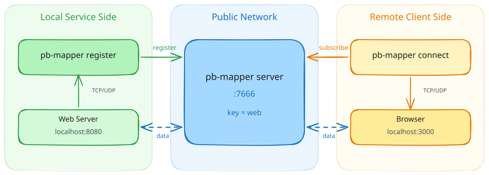

<div align="center">


<p>
  <a href="https://www.rust-lang.org/"></a>
  <a href="https://tokio.rs/"></a>
  <a href="https://flutter.dev/"></a>
  <a href="LICENSE"></a>
  <a href="https://github.com/acking-you/pb-mapper/releases"></a>
  <a href="https://github.com/acking-you/pb-mapper/actions/workflows/release.yml"></a>
  <a href="https://github.com/acking-you/pb-mapper/actions/workflows/docker-publish.yml"></a>
  <a href="https://github.com/acking-you/pb-mapper/stargazers"></a>
</p>

<p>
  <a href="README.md"><b>English</b></a> ·
  <a href="README.zh-CN.md">中文</a>
</p>

</div>

---

> **Remote control infrastructure for the agent harness era.**

Agent harnesses can write code, run tools, and coordinate long workflows. They
still need a narrow, durable path into private runtimes. **pb-mapper** provides
that network primitive: expose one relay port, register any number of keyed
TCP/UDP services behind it, and delegate access without publishing every
service or sharing the relay's root credential.

pb-mapper transports bytes. The service behind a tunnel still owns its
application-level authentication and authorization.

## Why it fits an agent harness

- **Compact and easy to embed** — one Rust binary contains the relay, register,
  connect, status, and administrator roles. Linux releases are distributed as a
  small, self-contained archive with no language runtime to install.
- **One public port, many control paths** — registration, subscription, status,
  and administration all enter through the same relay port. Adding another
  remote-control endpoint does not require another public listener.
- **Delegate access instead of the root key** — keep one 32-byte administrator
  key on the relay and issue renewable, expiring `pbmt1_` credentials to
  harnesses or workloads. Each credential receives an isolated namespace.
- **Revoke live access** — expiry, revocation, auth-state reset, and root-key
  rotation close affected live control and data connections.
- **Native performance, production experience** — the data path is implemented
  in Rust on Tokio, supports TCP and UDP, and has been exercised by long-running
  self-hosted products and real game-server traffic. The end-to-end suite covers
  the transport/encryption matrix and credential lifecycle.

## One relay, many private services



```text
 private runtime A ── register "app" ──┐
 private runtime B ── register "shell" ├──► pb-mapper relay :7666 ◄── agent harnesses
 private runtime C ── register "tools" ┘          one public port
```

- `pb-mapper register` runs beside a private TCP/UDP service and publishes a
  service name to the relay.
- `pb-mapper connect` runs beside an agent or operator and exposes that service
  on a local address.
- The relay matches both sides by namespace and service name, then forwards data
  bidirectionally.
- Different temporary credentials can reuse the same service names without
  seeing or colliding with each other.

This makes a relay a useful rendezvous layer for remote agent runtimes, coding
harnesses, private APIs, model gateways, browser-control endpoints, development
machines, and operational tools.

## Install the agent Skill

Tell your agent:

```text
Fetch and follow instructions from https://raw.githubusercontent.com/acking-you/pb-mapper/master/skills/pb-mapper-suite/INSTALL.md
```

## Credential model for automation

| Credential | Intended holder | Authority |
| --- | --- | --- |
| Administrator key | Relay operator or trusted provisioning automation | Issue, reveal, renew, revoke, rotate, inspect all namespaces |
| Temporary `pbmt1_` credential | One harness, tenant, device, or workload | Register, connect, and inspect only its own namespace |

Protocol v2 authenticates the encrypted first request without adding a separate
handshake round trip. Temporary credentials are derived from the administrator
key, persistent server instance ID, and key ID; the relay stores lifecycle
metadata rather than a copy of each temporary secret. Optional AES-256-GCM data
encryption is enabled with `--codec` when registering a service.

pb-mapper uses pre-shared credentials, not public-key identity. Use TLS or
another application protocol when you also need certificate-based endpoint
identity or protection against traffic analysis. See the
[authentication design](docs/authentication-v2.md) for the exact boundary.

## Current integration surface

| Surface | What is available today |
| --- | --- |
| Unified CLI | `server`, `register`, `connect`, `status`, and `admin` roles |
| Agent Skills | Complete installation, relay, register/connect, and verification through `pb-mapper-suite`, plus a separate release workflow |
| Operations | Linux systemd units, install scripts, Docker image, status and administrator inventory |
| Native embedding | Rust crate `pb-mapper` (`Client` for register/connect/status/admin), C ABI for the Flutter UI, Node-API package under `js/` |
| Networking | TCP and UDP, per-tunnel keep-alive, optional forwarded-data encryption |

### Rust SDK

```toml
pb-mapper = "0.5"
```

```rust,ignore
use pb_mapper::{Client, ClientConfig, RegisterRequest, Transport};

let client = Client::new(ClientConfig {
    server: "relay.example.com:7666".into(),
    credential: std::env::var("MSG_HEADER_KEY")?,
    keep_alive: true,
    namespace: None,
})?;
let registration = client.register(RegisterRequest {
    key: "echo".into(),
    local_addr: "127.0.0.1:8080".into(),
    transport: Transport::Tcp,
    codec: false,
    force_namespace: false,
}).await?;
registration.wait_ready().await?;
```

The CLI binary lives in `pb-mapper-cli`, which is not published to crates.io.
Build it from a checkout with `make build-pb-mapper` (or `cargo build --release
--bin pb-mapper`).

### TypeScript (Node-API)

```bash
npm install pb-mapper
```

```ts
import { Client } from "pb-mapper";

const client = new Client({
  server: "relay.example.com:7666",
  credential: process.env.MSG_HEADER_KEY!,
});
const admin = client.admin();
const issued = await admin.issueKey(3600, "agent");
```

## Roadmap: harness-native remote control

The current release provides the secure network, a Rust client SDK, and a
Node-API package. Remaining work:

- harness-specific adapters and credential automation built on the existing
  `pb-mapper-suite` workflow;
- further shrinking the client-only Node addon (release-node + strip is already
  under **5 MB** on linux-x64);
- browser and edge adapters for runtimes that cannot load a native Node-API addon;
- harness adapters and examples for remote model runtimes, tool servers,
  private APIs, development machines, and browser-control endpoints.

These are roadmap items, not yet part of the published compatibility contract.

## Build and documentation

```bash
make build-pb-mapper
cargo test
```

- User guide: [`docs/user-guide.md`](docs/user-guide.md)
- Authentication and protocol v2: [`docs/authentication-v2.md`](docs/authentication-v2.md)
- Docker server guide: [`DOCKER_README.md`](DOCKER_README.md)
- Chinese documentation: [`README.zh-CN.md`](README.zh-CN.md), [`docs/user-guide.zh-CN.md`](docs/user-guide.zh-CN.md)

Repository layout:

- `crates/` — Rust workspace: core, auth, protocol, server, client, SDK facade (`pb-mapper`), Node-API (`pb-mapper-node`), CLI, and testkit
- `js/` — JS package wrapping the Node-API addon (built with bun)
- `ui/` — Flutter UI and native C ABI bridge
- `skills/` — agent-readable deployment and release workflows
- `docs/` — architecture, authentication, user guides, and project assets
- `docker/`, `services/`, `scripts/` — packaging and operations

## License

Released under the [MIT License](LICENSE).
