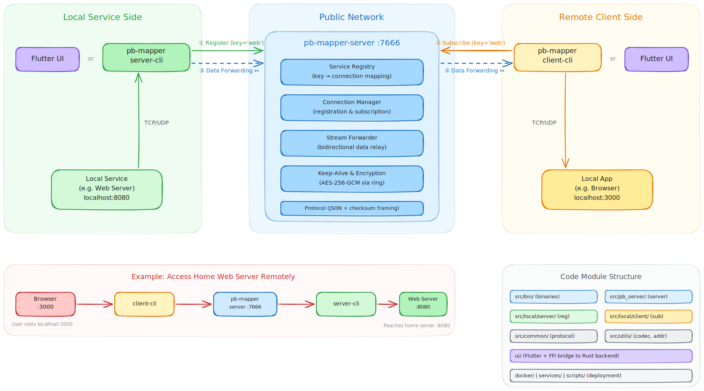

# pb-mapper

[English](README.md) | [中文](README.zh-CN.md)

pb-mapper 是一个基于 Rust 的服务映射系统，通过**一个**公网端口暴露**多个**本地 TCP/UDP 服务。与 frp 这类“按服务占用多个公网端口”的方案不同，pb-mapper 使用服务 key 进行注册与路由，让多项本地服务共享同一个公网入口并被其他人访问。

## 亮点

- **易用源于架构**：单公网端口 + 服务 key 注册机制，免去逐个服务规划端口；CLI 与 GUI 复用同一工作流。
- **可拓展架构**：服务端/客户端清晰拆分（`pb-mapper-server`、`pb-mapper-server-cli`、`pb-mapper-client-cli`），公共协议与工具位于 `src/common`、`src/utils`，便于新增能力与传输方式。
- **加密支持**：可选转发消息加密，使用 AES-256-GCM（`ring` 实现），在注册服务时通过 `--codec` 开启。
- **性能**：实际使用中（例如用 frp 直连方式对比开一个“幻兽帕鲁”UDP 服务器），延迟表现接近。

## 快速开始（服务端一键部署）

一条命令安装并注册 `pb-mapper-server` 的 systemd 服务（Linux x86_64，musl 构建）。默认端口 `7666`，默认密钥 `MSG_HEADER_KEY=abcdefghijklmnopqlsn123456789j01`。

```bash
curl -fsSL https://raw.githubusercontent.com/acking-you/pb-mapper/master/scripts/install-server-github.sh | bash
```

## 文档

- 使用手册（编译/运行/使用）：[`docs/user-guide.zh-CN.md`](docs/user-guide.zh-CN.md)
- Docker 服务器指南：[`DOCKER_README.md`](DOCKER_README.md)
- 英文文档：[`README.md`](README.md)、[`docs/user-guide.md`](docs/user-guide.md)

## 组件

- **pb-mapper-server**：中心路由（默认端口 `7666`）
- **pb-mapper-server-cli**：将本地 TCP/UDP 服务注册到服务器
- **pb-mapper-client-cli**：连接已注册的服务并在本地暴露端口
- **Flutter UI**（`ui/`）：服务器/客户端的图形化管理界面

## 架构



上图展示了三段式架构：

- **本地服务侧**（绿色）：`pb-mapper-server-cli`（或 Flutter UI）将本地 TCP/UDP 服务注册到公网服务器。
- **公网侧**（蓝色）：`pb-mapper-server` 维护服务注册表、管理连接，并执行双向数据转发。
- **远程客户端侧**（橙色）：`pb-mapper-client-cli`（或 Flutter UI）订阅服务 key，并在本地暴露端口。

### 具体示例：远程访问家里 Web 服务

假设你在家中运行了一个 `localhost:8080` 的 Web 服务，希望在咖啡店访问。

```
                  Home LAN                    Public Server                Coffee Shop
          ┌─────────────────────┐       ┌──────────────────┐       ┌──────────────────┐
          │  Web Server :8080   │       │  pb-mapper-server│       │  Browser :3000   │
          │        ↑            │       │     :7666        │       │       ↑          │
          │  server-cli ────────┼──────►│  key='web' ──────┼◄──────┼── client-cli     │
          └─────────────────────┘       └──────────────────┘       └──────────────────┘
```

**步骤 1**：在公网服务器启动中心路由

```bash
pb-mapper-server --port 7666
```

**步骤 2**：在家中机器注册 Web 服务

```bash
pb-mapper-server-cli --server <public-ip>:7666 --key web --local 127.0.0.1:8080
```

**步骤 3**：在咖啡店机器订阅并本地暴露

```bash
pb-mapper-client-cli --server <public-ip>:7666 --key web --local 127.0.0.1:3000
```

随后在咖啡店浏览器打开 `http://localhost:3000`，流量会经公网服务器回到家里的 Web 服务。

### 开发者视角

### Rust 核心
- **二进制入口**在 `src/bin/`，协议与网络通用逻辑位于
  `src/common` 与 `src/utils`。
- **服务端/客户端实现**主要在 `src/pb_server`、
  `src/local/server`、`src/local/client`。

### Flutter UI
- **分层结构**：
  - 界面与组件：`ui/lib/src/views`、`ui/lib/src/widgets`
  - UI 层 API：`ui/lib/src/ffi/pb_mapper_api.dart`
  - FFI 调度 + isolate：`ui/lib/src/ffi/pb_mapper_service.dart`
  - 低层 FFI：`ui/lib/src/ffi/pb_mapper_ffi.dart`
  - Rust FFI crate：`ui/native/pb_mapper_ffi`（C ABI + JSON 返回封装）
- **线程模型**：所有 FFI 调用都在后台 isolate 执行，避免阻塞 UI 线程。
- **响应格式**：Rust 统一返回 JSON 字符串（`{success, message, data}`），
  避免 bindings 代码生成并保持 ABI 稳定。

## 仓库结构

- `src/`：Rust 后端
- `ui/`：Flutter UI + 原生桥接
- `docs/`：文档
- `docker/`、`services/`、`scripts/`、`tests/`：部署与工具

## 开发

编译/运行/使用说明请见《使用手册》。
