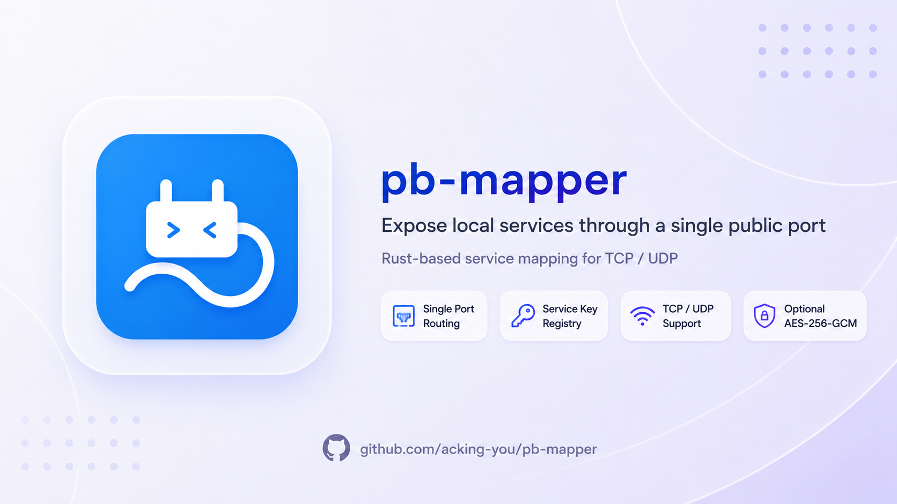
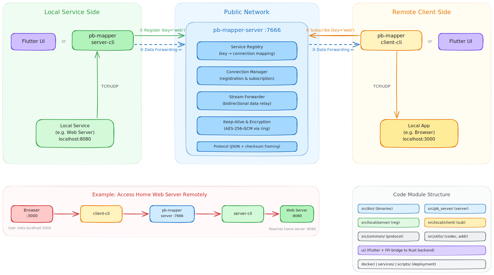

<div align="center">



<p>
  <a href="https://www.rust-lang.org/"></a>
  <a href="https://tokio.rs/"></a>
  <a href="https://flutter.dev/"></a>
  <a href="LICENSE"></a>
  <a href="https://github.com/acking-you/pb-mapper/releases"></a>
  <a href="https://github.com/acking-you/pb-mapper/actions/workflows/release.yml"></a>
  <a href="https://github.com/acking-you/pb-mapper/actions/workflows/docker-publish.yml"></a>
  <a href="https://github.com/acking-you/pb-mapper/stargazers"></a>
</p>

<p>
  <a href="README.md">English</a> ·
  <a href="README.zh-CN.md"><b>中文</b></a>
</p>

</div>

---

**pb-mapper** 是一个基于 Rust 的服务映射系统，通过**单个**公网端口暴露多项本地 TCP/UDP 服务。与 frp 那种"按服务占用多个公网端口"的方案不同，它通过服务 key 注册表让多项本地服务共享同一个公网入口，并被持有 key 的任意客户端访问。

## 亮点

- **单端口即用**：一个公网端口加一张服务 key 注册表，无需为每个服务规划端口；CLI 与 GUI 共享同一套工作流。
- **可拓展架构**：`pb-mapper-server`、`pb-mapper-server-cli`、`pb-mapper-client-cli` 清晰拆分，公共协议与工具集中在 `src/common`、`src/utils`，便于扩展新的传输方式与能力。
- **可选加密**：转发流量可启用 AES-256-GCM（基于 `ring`），在注册服务时通过 `--codec` 开启。
- **生产级性能**：在真实负载下（例如 Palworld UDP 服务器），延迟与 frp 直暴端口相当。

## 快速开始

### 推荐方式：AI 助手 + 部署 Skill

如果你使用 AI 编程助手（Claude Code、Cursor、Kiro），可以直接调用内置部署 skill 完成全交互式一键部署。远程主机无需访问 GitHub，binary 在本地下载后通过 SCP 上传：

- **服务端**：`/pb-mapper-server-deploy` — 本地下载 binary，通过 SCP 上传到远程，并配置 systemd 服务。
- **客户端隧道**：`/pb-mapper-client-cli-deploy` — 同样的"本地下载→上传"流程部署 `pb-mapper-client-cli`，含 systemd 服务与端到端验证。

Skill 会交互式收集 SSH 凭据、端口、加密密钥等参数，本地无法直连 GitHub 时会自动提示切换代理下载。

### 备选方式：一键安装脚本

如果远程主机能够直接访问 GitHub，一条命令即可在 Linux（x86_64，musl 构建）上安装并注册 `pb-mapper-server` 的 systemd 服务。默认端口 `7666`，默认启用 `--use-machine-msg-header-key`，并将 key 落盘到 `/var/lib/pb-mapper-server/msg_header_key`。

```bash
curl -fsSL https://raw.githubusercontent.com/acking-you/pb-mapper/master/scripts/install-server-github.sh | bash
```

安装完成后，在 `pb-mapper-server-cli` 与 `pb-mapper-client-cli` 中加载同一把 key：

```bash
export MSG_HEADER_KEY="$(cat /var/lib/pb-mapper-server/msg_header_key)"
```

## 架构



三段式架构：

- **本地服务侧**（绿色）：`pb-mapper-server-cli`（或 Flutter UI）将本地 TCP/UDP 服务注册到公网服务器。
- **公网侧**（蓝色）：`pb-mapper-server` 维护服务注册表、管理连接，并执行双向数据转发。
- **远程客户端侧**（橙色）：`pb-mapper-client-cli`（或 Flutter UI）订阅服务 key，并在本地暴露端口。

### 具体示例：远程访问家里的 Web 服务

假设你在家中运行了一个 `localhost:8080` 的 Web 服务，希望从咖啡店访问它。

```
                  Home LAN                    Public Server                Coffee Shop
          ┌─────────────────────┐       ┌──────────────────┐       ┌──────────────────┐
          │  Web Server :8080   │       │  pb-mapper-server│       │  Browser :3000   │
          │        ↑            │       │     :7666        │       │       ↑          │
          │  server-cli ────────┼──────►│  key='web' ──────┼◄──────┼── client-cli     │
          └─────────────────────┘       └──────────────────┘       └──────────────────┘
```

**1.** 在公网服务器启动中心路由：

```bash
pb-mapper-server --port 7666
```

**2.** 在家中机器注册 Web 服务：

```bash
pb-mapper-server-cli --server <public-ip>:7666 --key web --local 127.0.0.1:8080
```

**3.** 在咖啡店机器订阅并本地暴露：

```bash
pb-mapper-client-cli --server <public-ip>:7666 --key web --local 127.0.0.1:3000
```

随后在咖啡店浏览器打开 `http://localhost:3000`，流量会经公网服务器回到家里的 Web 服务。

## 组件

| 组件 | 角色 |
| --- | --- |
| `pb-mapper-server` | 中心路由（默认端口 `7666`） |
| `pb-mapper-server-cli` | 将本地 TCP/UDP 服务注册到服务器 |
| `pb-mapper-client-cli` | 订阅已注册的服务并在本地暴露端口 |
| **Flutter UI**（`ui/`） | 替代两个 CLI 的图形化界面 |

## 开发者视角

### Rust 核心

- 二进制入口在 `src/bin/`，协议与网络通用逻辑集中在 `src/common`、`src/utils`。
- 服务端/客户端实现拆分在 `src/pb_server`、`src/local/server`、`src/local/client`。

### Flutter UI

- **分层结构**
  - 界面与组件：`ui/lib/src/views`、`ui/lib/src/widgets`
  - UI 层 API：`ui/lib/src/ffi/pb_mapper_api.dart`
  - FFI 调度 + isolate：`ui/lib/src/ffi/pb_mapper_service.dart`
  - 低层 FFI 绑定：`ui/lib/src/ffi/pb_mapper_ffi.dart`
  - Rust FFI crate：`ui/native/pb_mapper_ffi`（C ABI + JSON 返回封装）
- **线程模型** — 所有 FFI 调用都在后台 isolate 上执行，避免阻塞 Flutter 的 UI 线程。
- **响应格式** — Rust 统一返回 JSON 字符串（`{success, message, data}`），跳过 bindings 代码生成并在迭代过程中保持 ABI 稳定。

## 文档

- 使用手册（编译/运行/使用）：[`docs/user-guide.zh-CN.md`](docs/user-guide.zh-CN.md)
- Docker 服务器指南：[`DOCKER_README.md`](DOCKER_README.md)
- English docs: [`README.md`](README.md)、[`docs/user-guide.md`](docs/user-guide.md)

## 仓库结构

- `src/` — Rust 后端
- `ui/` — Flutter UI + 原生桥接
- `docs/` — 文档与素材
- `docker/`、`services/`、`scripts/`、`tests/` — 部署与工具
- `skills/` — AI 编程助手部署 skill（服务端、客户端隧道）

## 许可证

基于 [MIT License](LICENSE) 发布。
