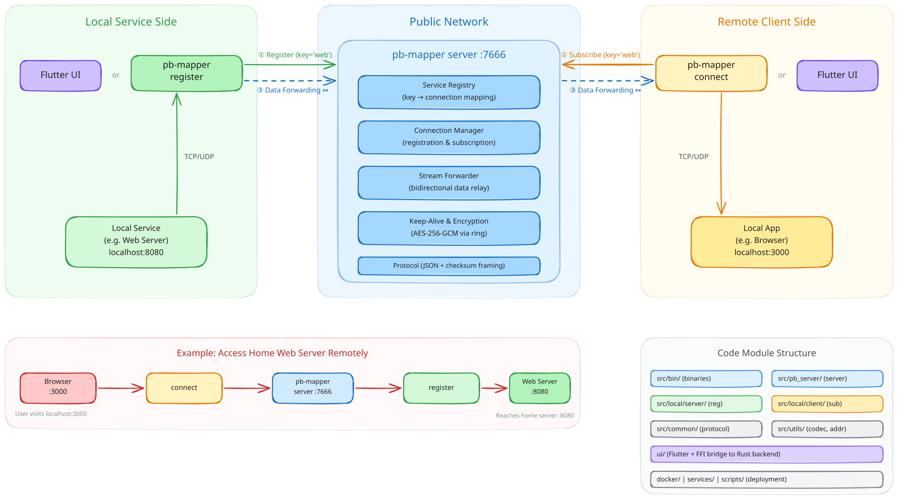

<div align="center">


<p>
  <a href="https://www.rust-lang.org/"></a>
  <a href="https://tokio.rs/"></a>
  <a href="https://flutter.dev/"></a>
  <a href="LICENSE"></a>
  <a href="https://github.com/acking-you/pb-mapper/releases"></a>
  <a href="https://github.com/acking-you/pb-mapper/actions/workflows/release.yml"></a>
  <a href="https://github.com/acking-you/pb-mapper/actions/workflows/docker-publish.yml"></a>
  <a href="https://github.com/acking-you/pb-mapper/stargazers"></a>
</p>

<p>
  <a href="README.md">English</a> ·
  <a href="README.zh-CN.md"><b>中文</b></a>
</p>

</div>

---

**pb-mapper** 通过**单个**公网端口暴露任意多项本地 TCP/UDP 服务。不同于 frp"一服务一端口"的映射方式，服务以 key 注册，持有 key 的客户端即可访问。

## 亮点

- **单端口即用**：服务 key 注册表取代逐个服务规划端口；CLI 与 GUI 共享同一套工作流。
- **可选加密**：转发流量可启用 AES-256-GCM（基于 `ring`），注册服务时用 `--codec` 开启。
- **生产可用**：真实负载下（例如 Palworld UDP 服务器），延迟与 frp 直暴端口相当。

## 快速开始

### 推荐方式：AI 助手部署 Skill

使用 AI 编程助手（Claude Code、Cursor、Kiro）时，内置 skill 会交互式完成部署。binary 在本地下载后通过 SCP 上传，远程主机无需访问 GitHub。

- `/pb-mapper-server-deploy` — 将 `pb-mapper-server` 部署为 systemd 服务。
- `/pb-mapper-client-cli-deploy` — 同样的流程部署 `pb-mapper-client-cli`，并附端到端验证。

### 备选方式：一键安装脚本

远程主机能直连 GitHub 时，一条命令即可在 Linux（x86_64，musl）上安装 `pb-mapper-server` 的 systemd 服务：端口 `7666`，启用 `--use-machine-msg-header-key`，key 落盘在 `/var/lib/pb-mapper-server/msg_header_key`。

```bash
curl -fsSL https://raw.githubusercontent.com/acking-you/pb-mapper/master/scripts/install-server-github.sh | bash
```

安装完成后，在 `pb-mapper-server-cli` 与 `pb-mapper-client-cli` 中加载同一把 key：

```bash
export MSG_HEADER_KEY="$(cat /var/lib/pb-mapper-server/msg_header_key)"
```

## 架构



- **本地服务侧**（绿色）：`pb-mapper-server-cli` 注册本地 TCP/UDP 服务。
- **公网侧**（蓝色）：`pb-mapper-server` 维护注册表并执行双向数据转发。
- **远程客户端侧**（橙色）：`pb-mapper-client-cli` 订阅服务 key，在本地暴露端口。

两个 CLI 都可以用 Flutter UI 替代。

### 示例：从咖啡店访问家里的 Web 服务

家中 Web 服务运行在 `localhost:8080`。

```
                  Home LAN                    Public Server                Coffee Shop
          ┌─────────────────────┐       ┌──────────────────┐       ┌──────────────────┐
          │  Web Server :8080   │       │  pb-mapper-server│       │  Browser :3000   │
          │        ↑            │       │     :7666        │       │       ↑          │
          │  server-cli ────────┼──────►│  key='web' ──────┼◄──────┼── client-cli     │
          └─────────────────────┘       └──────────────────┘       └──────────────────┘
```

```bash
# 1. 公网服务器：启动中心路由
pb-mapper-server --port 7666

# 2. 家中机器：以 key 'web' 注册服务
pb-mapper-server-cli --server <public-ip>:7666 --key web --local 127.0.0.1:8080

# 3. 咖啡店机器：订阅并在本地暴露
pb-mapper-client-cli --server <public-ip>:7666 --key web --local 127.0.0.1:3000
```

在咖啡店浏览器打开 `http://localhost:3000`，流量会经公网服务器回到家里的 Web 服务。

## 组件

| 组件 | 角色 |
| --- | --- |
| `pb-mapper-server` | 中心路由（默认端口 `7666`） |
| `pb-mapper-server-cli` | 将本地 TCP/UDP 服务注册到服务器 |
| `pb-mapper-client-cli` | 订阅已注册的服务并在本地暴露端口 |
| **Flutter UI**（`ui/`） | 替代两个 CLI 的图形化界面 |

## 开发者视角

- **Rust 核心**：二进制入口在 `src/bin/`；协议与网络通用逻辑在 `src/common`、`src/utils`；服务端/客户端实现在 `src/pb_server`、`src/local/server`、`src/local/client`。
- **Flutter UI**：界面在 `ui/lib/src/views`，FFI 各层在 `ui/lib/src/ffi`，Rust 桥接在 `ui/native/pb_mapper_ffi`。FFI 调用跑在后台 isolate，Rust 统一返回 JSON（`{success, message, data}`）以保持 C ABI 稳定。

## 文档

- 使用手册（编译/运行/使用）：[`docs/user-guide.zh-CN.md`](docs/user-guide.zh-CN.md)
- Docker 服务器指南：[`DOCKER_README.md`](DOCKER_README.md)
- English docs: [`README.md`](README.md)、[`docs/user-guide.md`](docs/user-guide.md)

## 仓库结构

- `src/` — Rust 后端
- `ui/` — Flutter UI + 原生桥接
- `docs/` — 文档与素材
- `docker/`、`services/`、`scripts/`、`tests/` — 部署与工具
- `skills/` — AI 编程助手部署 skill（服务端、客户端隧道）

## 许可证

基于 [MIT License](LICENSE) 发布。
