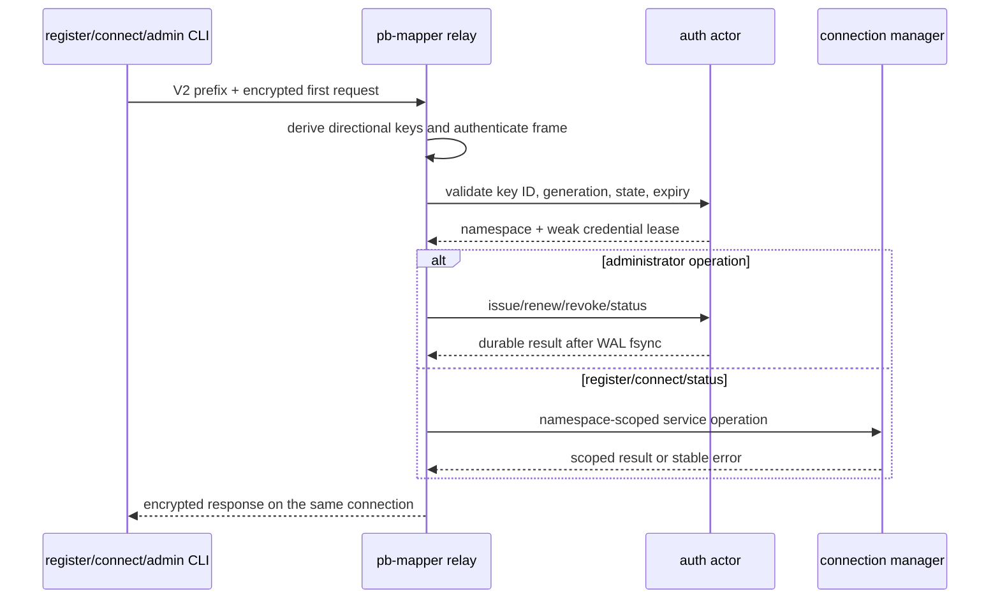

# Authentication and Protocol V2

## Background and goals

pb-mapper uses one public relay port for registration, subscription, status, and
administration. Version 0.4 keeps that transport model and adds two credential
levels without adding a TLS-style handshake:

- one 32-byte administrator key owns the relay;
- renewable `pbmt1_` temporary credentials can inspect, register, and connect
  only inside their own namespace;
- the first protocol-v2 frame authenticates and carries the request in one TCP
  flight;
- revocation, expiry, and root-key rotation close affected live control and data
  connections.

TLS is still appropriate when endpoint identity, certificate trust, or traffic
analysis resistance is required. Protocol v2 protects pb-mapper frames with a
pre-shared credential; it is not a replacement for a public-key PKI.

## Model and terminology

| Term | Meaning |
| --- | --- |
| Administrator key | The sole 32-byte root credential. It can manage keys and inspect every namespace. |
| Temporary credential | A printable `pbmt1_...` value containing a key ID and derived 32-byte secret. |
| Key ID | A 64-bit `generation:u32 | slot:u32` identifier used for direct slot lookup. |
| Namespace | `0` for the administrator, otherwise the temporary key ID. |
| Service name | A user-facing name within one namespace. Equal names in different temporary namespaces do not collide. |
| Credential lease | The cancellation object shared by connections authenticated with one credential. |

The administrator key is never copied into a temporary credential. A temporary
secret is derived with HKDF-SHA256 from the administrator key, the persistent
server instance ID, and the key ID. The fixed slot table stores lifecycle
metadata and a weak lease reference, not the temporary secret.

## End-to-end architecture



Only the long-lived registration control connection and each independently
opened subscribe/data connection carry a V2 first frame. The relay does not add
an extra authentication exchange when the register process opens a data TCP
connection for a request.

## Protocol-v2 framing

### Initial prefix

Every new client writes this 32-byte clear-text routing prefix:

| Bytes | Field |
| ---: | --- |
| 4 | Magic `PBM2` |
| 1 | Version `2` |
| 1 | Flags, currently `0` |
| 2 | Reserved, currently `0` |
| 8 | Big-endian key ID; `0` means administrator |
| 16 | Connection salt: 8-byte Unix timestamp plus 8 random bytes |

The prefix is not secret. It is authenticated as associated data on every
encrypted frame. Unsupported flags, versions, non-zero reserved bytes, and
timestamps outside the five-minute clock-skew window are rejected before
request dispatch. The encrypted first request is capped at 64 KiB before
authentication, while authenticated continuation frames retain the normal
protocol limit.

### Directional frame keys

HKDF-SHA256 uses the connection salt as salt and the credential's 32-byte secret
as input key material. Two independent outputs are expanded with
`pb-mapper-v2-c2s` and `pb-mapper-v2-s2c`. This prevents nonce reuse across
directions even though both directions begin with counter zero.

### Encrypted frames

Each frame is encoded as:

| Bytes | Field |
| ---: | --- |
| 8 | Big-endian monotonically increasing counter |
| 4 | Big-endian ciphertext length, including the 16-byte GCM tag |
| variable | AES-256-GCM ciphertext and tag |

The 96-bit AES-GCM nonce is four zero bytes followed by the 64-bit counter. AAD
contains the complete initial prefix, one direction byte, the counter, and the
ciphertext length. Counter mismatch, authentication failure, oversized frames,
and counter exhaustion close the connection.

The first client request uses client-to-server counter `0`. The first response
uses server-to-client counter `0`. Later control frames continue from counter
`1` through one stateful reader/writer per direction.

### Replay resistance

The relay fingerprints `(key_id, connection_salt)` and atomically checks and
inserts it in two rotating 1 MiB Bloom filters covering the current and previous
300-second windows, matching the accepted first-flight clock-skew interval. A probable duplicate returns the stable retryable error
`connection_salt_replayed`; one-shot administrator CLI operations retry once
with a fresh salt. Mutating administrator requests additionally claim their
exact fingerprint in the encrypted WAL before dispatch. Those claims survive
restart and compaction for ten minutes, so an old captured mutation cannot be
replayed after the Bloom window or a process restart.

## Credential lifecycle

### Issuance and renewal

`key issue` allocates a free fixed-table slot, increments its generation,
derives the secret, appends an encrypted WAL mutation, calls `fsync`, and only
then exposes the credential. `key renew` keeps the same credential and key ID,
updates its absolute expiry, and inserts a new versioned timing-wheel entry.
Stale wheel entries are ignored.

```bash
export MSG_HEADER_KEY="$(sudo cat /var/lib/pb-mapper/auth/admin.key)"

pb-mapper admin --server relay.example.com:7666 \
  key issue --ttl 24h --label home-web

pb-mapper admin --server relay.example.com:7666 \
  key renew 4294967296 --ttl 7d
```

Temporary TTLs are at least 10 seconds and at most 30 days by default. The
server maximum is configurable.

### Expiry, revocation, and garbage collection

A four-level hierarchical timing wheel owns the strong `Arc` for every active
temporary lease. Foreground authentication state contains only `Weak`
references. Expiry or explicit revocation cancels the lease, immediately
causing authenticated control and data tasks to drop their TCP streams.
Tombstones remain briefly for stable diagnostics, then become reusable slots.

```bash
pb-mapper admin --server relay.example.com:7666 key revoke 4294967296
pb-mapper admin --server relay.example.com:7666 key gc
```

### Root rotation and state reset

Root rotation writes an empty snapshot encrypted with the new key, preserves
the bounded audit history, persists `admin.key`, and then switches the key and
administrator lease as one state transition. It invalidates all temporary
credentials and closes connections authenticated with the old administrator or
temporary keys. The CLI stages the candidate key before the request and verifies
the new key with an authenticated status call. When `--key-file` is omitted,
the recovery copy is written below `$XDG_CONFIG_HOME/pb-mapper` (or
`$HOME/.config/pb-mapper`) rather than requiring local `/var/lib` access.

An explicit auth-state reset also invalidates all temporary credentials. It
rotates the server instance ID so credentials from a corrupted or lost slot
table cannot become valid again if a key ID is later reused.

## Namespace authorization

Temporary credentials may perform `register`, `connect`, and `status` only in
their own namespace. They cannot issue keys, reveal credentials, inspect other
namespaces, alter protocol policy, reset auth state, or rotate the root key.

The administrator defaults to namespace `0`. It may inspect or connect to a
temporary namespace with `--namespace <key-id>`. Registering into another
namespace additionally requires `--force` to avoid accidental ownership
confusion.

Temporary-key service names are 1-128 ASCII bytes from
`[A-Za-z0-9._:-]`. The relay enforces per-namespace caps for services,
registration connections, active streams, and new-stream rate.

| Approach | Memory and lookup | Revocation | Namespace isolation | Wire cost |
| --- | --- | --- | --- | --- |
| Stateless signed token | Minimal server state | Requires a deny list | Token claim based | One request |
| Stateful hash map | Proportional allocations and hashing | Direct | Direct | One request |
| Fixed slots plus derived secrets | Fixed hot memory and O(1) lookup | Direct slot cancellation | Key ID is namespace | One request |

The fixed-slot design deliberately accepts bounded server state to make early
revocation and hard connection closure deterministic.

## Persistence and safe mode

The Linux system-service state directory is `/var/lib/pb-mapper/auth`. macOS
and Windows desktop binaries default to a user-writable application directory
instead of `/var/lib`:

| File | Purpose |
| --- | --- |
| `admin.key` | Root credential, mode `0600` |
| `server-instance-id` | 16-byte persistent derivation identity |
| `auth.snapshot` | AES-256-GCM encrypted compact slot state |
| `auth.wal` | Length-prefixed, individually encrypted mutations and audit records |

The directory is mode `0700`. Mutating operations acknowledge only after the
WAL record is synced. The actor compacts state every five minutes with an atomic
snapshot replacement and WAL truncation. The snapshot carries the bounded
audit history and active administrator replay claims, so compaction does not
discard either security record.

The Flutter server uses its application config directory's `auth/` child and
does not report itself running until both the TCP listener and authentication
state have initialized successfully. This keeps desktop/mobile starts writable
without pretending that a failed `/var/lib` initialization succeeded.

Invalid authentication-state headers, failed integrity checks, truncated WAL
records, schema mismatch, and failed compaction place temporary authentication
in safe mode. Administrator authentication stays available for inspection and
explicit reset; temporary authentication fails closed.

## Administration and output contracts

```bash
pb-mapper admin --server relay.example.com:7666 status
pb-mapper admin --server relay.example.com:7666 key list --page-size 100
pb-mapper admin --server relay.example.com:7666 key show 4294967296
pb-mapper admin --server relay.example.com:7666 key reveal 4294967296
pb-mapper admin --server relay.example.com:7666 service list --key-id 4294967296
pb-mapper admin --server relay.example.com:7666 connection list --all
pb-mapper admin --server relay.example.com:7666 legacy-protocol set deny
pb-mapper admin --server relay.example.com:7666 auth-state reset --confirm
pb-mapper admin --server relay.example.com:7666 root-key rotate
```

`--output human|json|ndjson` controls rendering. Pages default to 100 and are
capped at 1000. `--all` follows every page while preserving the selected output
format. NDJSON is the streaming choice for large inventories; JSON emits one
combined document and human output emits one combined table.

Stable structured errors contain `code`, `message`, `retryable`, and
`server_time`. Authentication failure logs include stage, key ID, peer, and
reason but never credential material. Repeated failures are emitted five times
per minute per `(peer IP, key ID, reason)`, followed by a suppression summary.

## Migration and compatibility

New clients always emit protocol v2. A v0.4 server defaults to accepting legacy
framing so older clients can be upgraded without an outage. Operators can view
legacy connection counters, upgrade all clients, and then set the policy to
`deny`. Upgrade the relay before any client because v0.3 relays do not understand
the v2 first-frame magic. An explicitly configured `PB_MAPPER_LEGACY_PROTOCOL`
is trimmed and must be `allow` or `deny`; malformed values fail closed to `deny`.

Fresh servers generate a random administrator key. Both the relay and install
scripts preserve an existing `/var/lib/pb-mapper-server/msg_header_key` by
copying it to the new `admin.key` path when no new key or environment credential
is configured. `--use-machine-msg-header-key` remains available only as an
explicit legacy compatibility option.

Docker deployments must persist `/var/lib/pb-mapper/auth`; otherwise a recreated
container generates a different root key and cannot decrypt previous auth
state.

## Operations playbook

### Temporary credential rejected after renewal

1. Run `pb-mapper admin status` and confirm `safe_mode=false`.
2. Run `key show <id>` and verify the key is `active` and its absolute expiry.
3. Check structured logs for `temporary_key_generation_mismatch`,
   `temporary_key_expired`, or `protocol_v2_decrypt_failed`.
4. If the credential text was lost or copied incorrectly, run `key reveal <id>`
   and replace the endpoint configuration. Renewal does not change the value.

### Relay starts in safe mode

1. Preserve the entire auth directory for diagnosis.
2. Confirm `admin.key`, `server-instance-id`, snapshot, and WAL belong to the
   same server instance and were not partially restored.
3. Use `pb-mapper admin status`; administrator access remains available.
4. If recovery is impossible, run `auth-state reset --confirm`, then issue new
   temporary credentials. Reset rotates the server instance ID and closes old
   workloads.

### Legacy clients stop connecting

1. Check `admin status` for the current legacy policy and active legacy count.
2. If policy is `deny`, upgrade the client or temporarily set it to `allow`.
3. New clients should log protocol `V2`; a continuing legacy count identifies
   an old binary or integration that still needs replacement.

## Code index

- Credential format and process configuration: `src/common/checksum.rs`
- Authentication facade and shared model: `src/common/auth.rs`
- Lifecycle actor, persistence, runtime, and timing wheel:
  `src/common/auth/{actor,persistence,runtime,timing_wheel}.rs`
- V2 session facade plus frame, limiter, and replay modules:
  `src/common/message/secure.rs` and `src/common/message/secure/`
- Relay state, runtime loop, and connection dispatch:
  `src/pb_server/{mod,runtime,connection}.rs`
- Administrator request execution: `src/pb_server/admin.rs`
- Unified CLI and administrator command module: `src/bin/pb-mapper.rs` and
  `src/bin/pb-mapper/admin.rs`

## Summary

Version 0.4 retains pb-mapper's one-port, long-lived-control-connection model
while separating root administration from scoped workload access. Temporary
keys are renewable but revocable, namespace collisions are eliminated, and
authentication remains part of the first request. The explicit operational
boundary is unchanged: protocol v2 is symmetric pre-shared-key security, while
TLS remains the layer for certificate-based endpoint identity.
