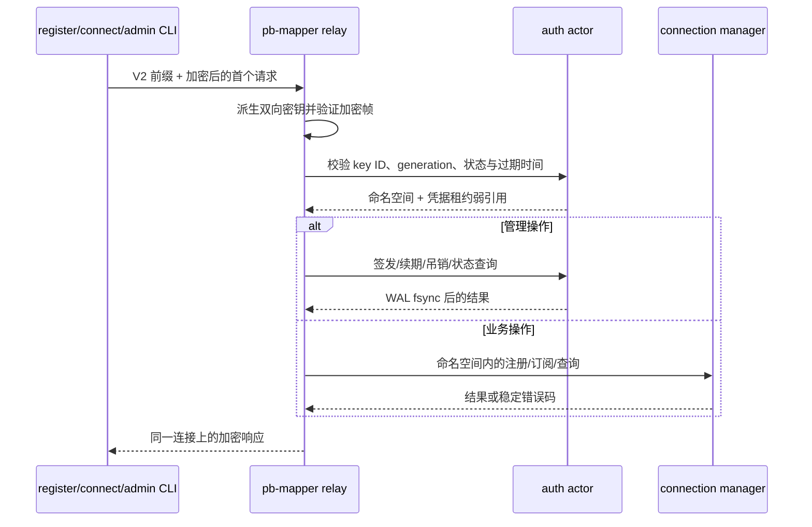

# 认证体系与 V2 协议

## 背景与目标

pb-mapper 的注册、订阅、状态与管理流量共用一个公网端口。0.4 版本不改变这一
连接模型，也不引入类似 TLS 的额外握手，而是在原有对称密钥体系内增加两级权限：

- 一把 32 字节管理员密钥拥有中继的全部权限；
- 可续期、可提前吊销、自动过期的 `pbmt1_` 临时凭据只能查看、注册和连接自己的
  命名空间；
- V2 第一个加密帧同时完成鉴权与请求传输，不增加一次网络往返；
- 过期、吊销与根密钥轮换会主动关闭受影响的控制连接和数据连接。

V2 是预共享密钥协议。当系统还需要证书身份、公开信任链或对流量分析的额外防护时，
TLS 仍然有独立价值，V2 不替代公钥 PKI。

## 核心模型

| 概念 | 含义 |
| --- | --- |
| 管理员密钥 | 唯一的 32 字节根凭据，可管理密钥并查看全部命名空间。 |
| 临时凭据 | `pbmt1_...` 字符串，携带 key ID 与派生后的 32 字节 secret。 |
| Key ID | 64 位 `generation:u32 | slot:u32`，用于直接定位固定槽位。 |
| 命名空间 | 管理员默认为 `0`；临时凭据的命名空间就是自己的 key ID。 |
| 凭据租约 | 同一凭据认证出的连接共同观察的取消对象。 |

临时 secret 由管理员密钥、持久化 server instance ID 与 key ID 通过
HKDF-SHA256 派生。服务端固定槽位只存生命周期元数据与弱引用，不存临时 secret。

## 端到端数据流



register 进程长期保持的控制连接只在建立时认证一次。后续每次业务请求拉起的新数据
TCP 连接仍有自己的 V2 首帧，但不会在其上再做多轮鉴权交换。

## V2 帧结构

### 首帧前缀

新客户端先写入 32 字节明文路由前缀：

| 字节数 | 字段 |
| ---: | --- |
| 4 | Magic `PBM2` |
| 1 | 版本 `2` |
| 1 | Flags，当前必须为 `0` |
| 2 | Reserved，当前必须为 `0` |
| 8 | 大端 key ID；`0` 表示管理员 |
| 16 | connection salt：8 字节 Unix 时间戳 + 8 字节随机数 |

前缀不承担保密作用，但会作为每个加密帧的 AAD 被完整认证。未知版本、flags、
reserved 值或超出五分钟时钟偏差窗口的时间戳会在请求分发前被拒绝。未认证的首个
加密请求上限为 64 KiB；鉴权完成后的后续帧仍沿用正常协议上限。

### 双向密钥与计数器

HKDF-SHA256 使用 connection salt 作为 salt，凭据的 32 字节 secret 作为 IKM，
分别以 `pb-mapper-v2-c2s` 与 `pb-mapper-v2-s2c` 派生两个 AES-256-GCM 密钥。
因此两个方向都从计数器 0 开始，也不会重复使用同一密钥与 nonce 组合。

每个加密帧由 8 字节大端计数器、4 字节密文长度、密文与 16 字节 GCM tag 组成。
96 位 nonce 是四个零字节加 64 位计数器。AAD 包含完整首帧前缀、方向字节、计数器
与密文长度。计数器不连续、认证失败、帧过大或计数器耗尽都会关闭连接。

首个请求使用 C2S counter 0，首个响应使用 S2C counter 0；后续控制消息由同一组
有状态 reader/writer 从 counter 1 继续。

### 重放检测

服务端对 `(key_id, connection_salt)` 做指纹，并在同一个临界区内完成两个轮换的
1 MiB Bloom filter 的检查与写入，覆盖当前与上一个 600 秒窗口，使首帧允许的
最大未来时间戳无法在过滤器遗忘后继续重放。疑似重复会返回
可重试错误 `connection_salt_replayed`；一次性 admin CLI 会自动换 salt 重试一次。
会修改状态的管理员请求还会在分发前把精确指纹写入加密 WAL；该记录在十分钟内跨
重启、跨 compact 保留，不能通过等待 Bloom 窗口结束或重启进程来重放旧操作。

## 临时凭据生命周期

### 签发与续期

签发会寻找空槽位、递增 generation、派生 secret、写入加密 WAL 并 `fsync`，随后才
把凭据返回给管理员。续期不换 key ID 与凭据文本，只更新绝对过期时间并把新版本任务
放入时间轮，旧任务到期时因版本不匹配而被忽略。

```bash
export MSG_HEADER_KEY="$(sudo cat /var/lib/pb-mapper/auth/admin.key)"
pb-mapper admin --server relay.example.com:7666 \
  key issue --ttl 24h --label home-web
pb-mapper admin --server relay.example.com:7666 \
  key renew 4294967296 --ttl 7d
```

默认最短 TTL 为 10 秒，最长为 30 天，服务端可调整最大值。

### 到期、吊销与 GC

四层层级时间轮持有每个活动凭据租约的强 `Arc`；前台认证状态只持有 `Weak`。
到期或管理员吊销会取消租约，相关控制任务和数据转发任务立即释放 TCP 连接。短暂保留
tombstone 以给出稳定错误后，槽位可以复用。显式 `key gc` 可立即清理非活动槽位。

### 根密钥轮换与状态重置

根密钥轮换先用新密钥写空 snapshot，同时保留有上限的审计历史，持久化
`admin.key`，再把密钥与管理员 lease 作为一次状态变更切换。它会使全部临时凭据失效，
并关闭旧管理员或临时凭据建立的连接。CLI 在发请求前保存候选 key，完成后再用新 key
执行一次 `admin status` 验证。未指定 `--key-file` 时，恢复副本默认写到
`$XDG_CONFIG_HOME/pb-mapper`（或 `$HOME/.config/pb-mapper`），不要求本机能写
`/var/lib`。

`auth-state reset --confirm` 同样会清空临时凭据，并轮换 server instance ID。这样即使
原槽位表损坏或丢失，旧凭据也不会因为未来复用了相同 key ID 而重新有效。

## 命名空间与权限边界

临时凭据只能在自己的命名空间执行 `register`、`connect` 与 `status`。它不能签发或
查看其他 key、进入其他命名空间、修改 legacy 策略、重置状态或轮换管理员密钥。

管理员默认使用命名空间 0；通过 `--namespace <key-id>` 可以查看或连接临时命名空间。
管理员要在临时命名空间内注册服务时还必须显式使用 `--force`，避免误把业务服务挂到
错误租户。

临时凭据的 service name 限制为 1 到 128 个 ASCII 字节，字符集为
`[A-Za-z0-9._:-]`。服务端分别按命名空间限制 service 数、单 service 注册连接数、
活动 stream 数与新建 stream 速率。

| 方案 | 内存与查询 | 提前吊销 | 命名空间隔离 | 网络成本 |
| --- | --- | --- | --- | --- |
| 无状态签名 token | 服务端状态少 | 仍需 deny list | 依赖 token claim | 一个请求 |
| 通用 HashMap | 动态分配与哈希 | 直接删除 | 直接 | 一个请求 |
| 固定槽位 + 派生 secret | 固定热内存、O(1) 查找 | 直接取消槽位租约 | key ID 即 namespace | 一个请求 |

当前方案明确接受有上限的服务端状态，以换取确定的提前吊销与活动连接硬关闭。

## 持久化与安全模式

Linux 系统服务默认目录是 `/var/lib/pb-mapper/auth`，权限为 `0700`。macOS 与
Windows 桌面二进制默认写到用户可写的应用目录，而不是 `/var/lib`：

| 文件 | 用途 |
| --- | --- |
| `admin.key` | 根凭据，权限 `0600` |
| `server-instance-id` | 16 字节持久派生身份 |
| `auth.snapshot` | AES-256-GCM 加密的紧凑槽位快照 |
| `auth.wal` | 带长度前缀、逐条加密的 mutation 与 audit |

变更只有在 WAL 同步成功后才对外确认。后台 actor 每五分钟原子替换 snapshot 并截断
WAL；snapshot 同时保存有上限的审计历史和仍有效的管理员重放声明，compact 不会丢弃
这些安全记录。无效文件头、完整性验证失败、WAL 截断、schema 不匹配或 compact 失败
都会进入 safe mode：临时凭据全部 fail closed，管理员仍可查看状态并执行显式 reset。

Flutter 启动服务端时使用应用配置目录下的 `auth/` 子目录，并且只有 TCP listener 与
认证状态都初始化成功后才会报告 running；桌面和移动端无需写 `/var/lib`，初始化失败
时也不会出现虚假的运行状态。

## 管理命令与输出

```bash
pb-mapper admin --server relay.example.com:7666 status
pb-mapper admin --server relay.example.com:7666 key list --page-size 100
pb-mapper admin --server relay.example.com:7666 key show 4294967296
pb-mapper admin --server relay.example.com:7666 key reveal 4294967296
pb-mapper admin --server relay.example.com:7666 service list --key-id 4294967296
pb-mapper admin --server relay.example.com:7666 connection list --all
pb-mapper admin --server relay.example.com:7666 legacy-protocol set deny
pb-mapper admin --server relay.example.com:7666 auth-state reset --confirm
pb-mapper admin --server relay.example.com:7666 root-key rotate
```

`--output human|json|ndjson` 控制展示格式。默认每页 100，最大 1000；`--all` 自动翻完
所有页面并保留选定的输出格式。大列表应选择 NDJSON 流式输出；JSON 输出单个合并文档，
human 输出单个合并表格。稳定错误结构包含 `code`、`message`、
`retryable` 与 `server_time`。

日志记录 auth stage、key ID、peer 与 reason，但不记录凭据。相同
`(peer IP, key ID, reason)` 每分钟最多直接输出 5 次，下一窗口汇总被抑制的数量。

## 迁移与兼容性

新客户端固定发送 V2。0.4 服务端默认暂时接受旧帧，方便滚动升级；确认
`active_legacy_connections` 归零后，可执行 `legacy-protocol set deny`。必须先升级中继、
再升级客户端，因为 0.3 中继无法识别 V2 首帧 magic。显式配置的
`PB_MAPPER_LEGACY_PROTOCOL` 会先去除首尾空白，并且只能是 `allow` 或 `deny`；
无效值会 fail closed 为 `deny`。

新安装会随机生成管理员密钥。中继自身与安装脚本在未配置新 key 或环境变量时，如果
发现旧的 `/var/lib/pb-mapper-server/msg_header_key`，会将其复制到新路径，保留现有
业务连接。`--use-machine-msg-header-key` 只作为明确的兼容选项继续存在。

Docker 必须持久化 `/var/lib/pb-mapper/auth`；否则重建容器会产生新管理员密钥，并且
无法读取先前认证状态。

## 运维排障

### 续期后临时凭据仍被拒绝

1. 执行 `admin status`，确认 `safe_mode=false`。
2. 执行 `key show <id>`，确认状态为 active 并核对绝对过期时间。
3. 从结构化日志区分 generation 不匹配、已过期与 V2 解密失败。
4. 如果只是凭据文本复制错误，执行 `key reveal <id>` 重新配置；续期本身不会换凭据。

### 服务端进入 safe mode

1. 先完整保留 auth 目录用于诊断。
2. 确认 key、instance ID、snapshot 与 WAL 是否来自同一份服务器状态。
3. 使用管理员 key 查询 `admin status`；管理员通道仍然可用。
4. 无法恢复时执行 `auth-state reset --confirm`，再重新签发业务凭据。该操作会轮换
   instance ID，并断开旧业务。

### 禁用 legacy 后仍有旧客户端

1. 在 `admin status` 查看 legacy policy、当前连接数与最后连接时间。
2. 如果业务尚未升级，可短暂改回 `allow`，但应尽快升级客户端。
3. 新客户端的服务端日志应显示协议 `V2`；仍增长的 legacy 计数可以定位旧 binary。

## 代码索引

- 凭据格式与进程配置：`src/common/checksum.rs`
- 认证 facade 与共享模型：`src/common/auth.rs`
- 生命周期 actor、持久化、runtime 与时间轮：
  `src/common/auth/{actor,persistence,runtime,timing_wheel}.rs`
- V2 session facade、frame、限流与 replay 模块：
  `src/common/message/secure.rs` 与 `src/common/message/secure/`
- 中继状态、runtime loop 与连接分发：`src/pb_server/{mod,runtime,connection}.rs`
- 管理请求执行：`src/pb_server/admin.rs`
- 统一 CLI 与管理员命令模块：`src/bin/pb-mapper.rs`、`src/bin/pb-mapper/admin.rs`

## 总结

0.4 在保持单端口与长控制连接模型的同时，把根管理权限与业务访问权限拆开。临时凭据
可续期、可吊销、按命名空间隔离，鉴权仍然包含在第一个业务请求内。需要明确保留的
边界是：V2 解决预共享密钥下的帧认证与权限控制，证书身份仍属于 TLS 层。
