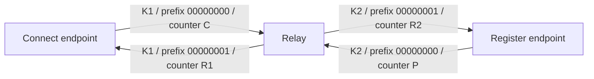

# Data encryption and rolling upgrades

This change preserves wire interoperability with the data format used by 0.5.2.
It does not require register, connect and relay processes to restart together.
The `--codec` default stays off; unencrypted forwarding remains byte transparent.
Existing credentials, namespaces, service keys and CLI options do not change.

## Per-leg negotiation

An updated built-in TCP/UDP endpoint adds `data_protocol: 2` to its authenticated
`Subcribe`/`SubcribeScoped` or `Stream`/`StreamScoped` JSON request. An old relay
ignores this unknown optional field and returns its unchanged response. A new
relay selects version 2 only for an endpoint that offered it over control-v2,
and only when the service requests data encryption. Selection is carried in the
existing authenticated `Subcribe` or `Stream` response. Absent selection means
legacy; unknown or unsolicited selection is an error.

Negotiation uses the existing setup messages: no probe connection, retry,
additional round trip, timer, replay cache or background task. Authentication
failure, timeout, truncation or malformed selection never trigger a legacy retry.
Setup responses remain within the existing bounded setup deadline.

| Relay | Connect endpoint | Register endpoint | Encrypted data format |
| --- | --- | --- | --- |
| 0.5.2 | New or old | New or old | Legacy on both legs |
| New | Old | Old | Legacy on both legs, independent per-leg keys |
| New | New | Old | V2 subscriber leg; legacy publisher leg |
| New | Old | New | Legacy subscriber leg; V2 publisher leg |
| New | New | New | V2 on both legs |

The older **control framing** remains a separate setting: a new relay accepts
pre-control-v2 clients only when its existing legacy policy permits them. This
change does not make new clients speak to relays predating control-v2, and does
not relax that authentication policy.

## Key and nonce ownership

The relay generates a fresh random 32-byte data key for **each leg** of every
subscription, including legacy legs. Both directions on a v2 leg share that key.
They use disjoint nonce prefixes, so their counters can each start at zero
without reusing a nonce under the same key. There is **no data-key HKDF**.



```text
nonce (12 bytes, computed locally; not transmitted):
+---------------------------+----------------------------------+
| direction prefix: 4 bytes | independent counter: 8 bytes BE  |
+---------------------------+----------------------------------+
  endpoint -> relay: 0         0, 1, 2, ... (checked, no wrap)
  relay -> endpoint: 1         0, 1, 2, ... (checked, no wrap)

wire frame (unchanged):
+--------------+------------+------------------+---------------+
| checksum: 4B | length: 4B | ciphertext: nB   | GCM tag: 16B  |
+--------------+------------+------------------+---------------+
```

Setup installs the existing per-leg key with the selected prefix. Compared with
legacy encryption there is no additional key derivation, network round trip or
per-frame allocation. Negotiation adds an optional JSON field only to existing
setup messages. Each data frame still performs one AES-GCM operation per
sender/receiver, using the same nonce-update path as the legacy codec. Counters
reserve their value before sealing or socket writes and fail before exhaustion.
Legacy counter bytes stay identical; updated legacy codecs also fail
at their original 32-bit limit. Control-v2 writers reserve before sealing and
become terminal after an interrupted write, preventing nonce reuse and a partial
frame restart. None of these counter fixes change successful legacy frames.

Compatibility does not repair an unmodified old peer's within-leg bidirectional
nonce reuse. An old relay also retains its old shared-key behavior. Upgrade all
three roles for full data-v2 protection. The relay terminates both legs; this is
not end-to-end secrecy from the relay, and PSK transport has no forward secrecy.

## SDK boundary

High-level `Client`, register/connect requests and the existing
`StreamForward::forward_local_to_remote` interface remain available. Custom
`StreamForward` implementations advertise no new capability unless they opt
into `supports_data_v2` and implement the negotiated forwarding method. Existing
SDK workers keep operating until deliberately replaced.

Low-level Rust users constructing `PbConnRequest` or `PbConnResponse` data
variants must initialize the added `data_protocol` field (`None` for legacy),
or ignore it in match patterns. This is a source schema change, separate from
wire compatibility; account for it before publishing a semver release.

## Verification

`data_compatibility` covers both legacy/new endpoint choices independently over
real TCP and UDP relay forwarding. It asserts independent root keys, selected
versions, byte integrity, datagram boundaries and both directions. Existing
tunnel tests cover unencrypted/encrypted local TCP/UDP and long-lived bursts.
Unit tests cover old JSON shapes/readers, invalid negotiation, nonce-domain separation,
replay, cancellation and counter exhaustion.

The local validation used the 0.5.2 relay revision `3e325a8`, an installed
0.5.2 CLI copy, and the new local build; all 32 binary combinations passed.

For historical executables, build the `compatibility_relay` example against
both revisions and retain separate outputs. The example binds only `127.0.0.1`
on an OS-assigned port and uses a public test credential. Run:

```sh
python3 scripts/test_version_compatibility.py \
  --old /path/to/old/pb-mapper --new /path/to/new/pb-mapper \
  --old-relay /path/to/old/compatibility_relay \
  --new-relay /path/to/new/compatibility_relay
```

The script checks all eight relay/register/connect version combinations over
TCP/UDP with encryption on/off (32 cases). It owns its child processes and
temporary authentication directories; no installed binary or existing process
is replaced, and no system network settings are changed.

The unpublished directional-HKDF prototype was replaced before 0.6.0. Its
data-v2 format was never released and must not be used with this version.

## Performance check

The release-mode `data_codec_bench` example alternates legacy/v2 order over nine
samples, with warmup and preallocated buffers. On the local Linux/WSL2 machine
(2026-10-04), median setup of one endpoint's read/write codecs was 213.32 ns
legacy and 213.73 ns v2 (+0.19%). Encrypt/decrypt of 256 bytes was 129.34 / 129.16
ns (-0.14%); 16 KiB was 2455.38 / 2457.81 ns (+0.10%). These differences do not
establish a measurable regression; they are local microbenchmarks, not WAN
latency or whole-tunnel throughput guarantees. Reproduce with:

```sh
cargo run --release -p pb-mapper-protocol --example data_codec_bench
```
