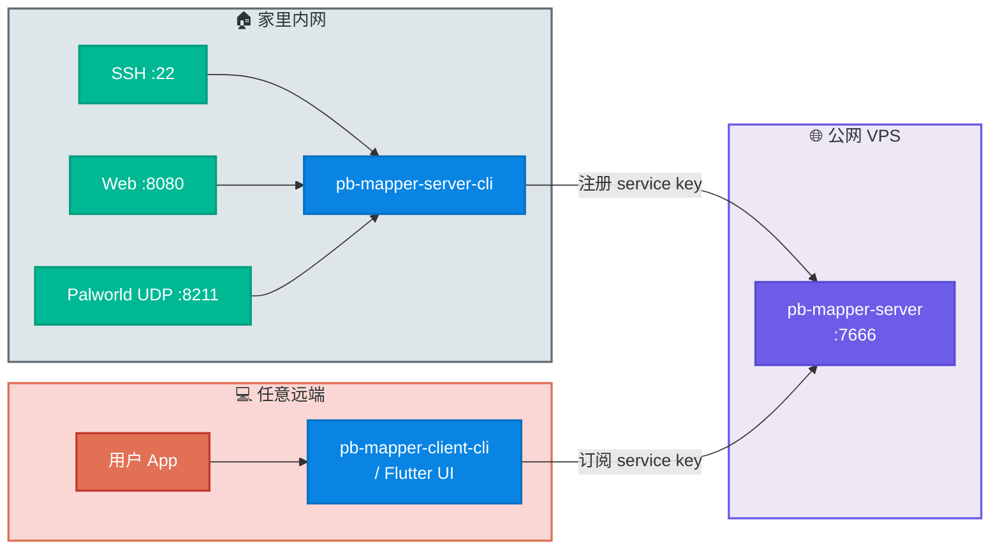

# 两年只为一件事：把公网穿透做成我每天离不开的工具——pb-mapper

> 一个用 Rust 从零写的公网穿透工具，一根公网端口承载无限多本地服务，CLI 能跑、Flutter UI 也能跑，部署还能让 AI Agent 一键完成。

## 这是个什么东西

[pb-mapper](https://github.com/acking-you/pb-mapper) 是一套基于 Rust 的 TCP/UDP 公网穿透系统。它和 frp 这类按端口一对一映射的方式不太一样：所有本地服务共用同一个公网端口，用一个 **service key** 做注册与订阅，公网侧的 `pb-mapper-server` 充当会合点，做服务注册表 + 双向流转发。

换成白话：家里的网盘、代码编译机、UDP 游戏房、个人博客后端……想暴露几个就暴露几个，公网 VPS 上只开 `7666` 一个端口就够了，不用每加一个服务就去防火墙放一行。



## 技术栈一瞥

- **核心语言**：Rust 2021，异步运行时 Tokio，内存分配器用 `better_mimalloc_rs`（mimalloc 的 Rust 封装）降低常驻内存
- **网络底层**：自研 `uni-stream` 把 TCP/UDP 抽象成统一的流接口，`socket2` 做底层 socket 控制，`trust-dns-resolver` 处理 DNS
- **协议序列化**：serde + serde_json，自定义帧格式带 checksum 和长度头，可选 `ring` 做 AES-256-GCM 加密
- **控制连接**：自己写了 V2 控制连接池 + 租约机制，避免 heartbeat 抖动导致误判断开
- **GUI 层**：Flutter 3.9+ 前端，Rust 后端通过 **纯 C ABI FFI** 暴露函数，用 `cdylib`/`staticlib` 双产物打通 Android/iOS/桌面全平台

关于 FFI 这块多说一句。最开始 UI 走的是 Rinf（signal-based 的 Rust↔Flutter 桥），好用但产物大、对冷启动不友好。后来直接切到裸 FFI：`ui/native/pb_mapper_ffi` 暴露一组 `pb_mapper_*` C 函数（见 `ui/native/pb_mapper_ffi/src/lib.rs:14`），Flutter 侧用 `dart:ffi` 直接调。换来的是 APK 体积、启动速度、可调试性都明显变好，代价是自己要写 handle 生命周期与 JSON 字符串的跨语言编解码。

## 你有三种方式把它跑起来

公网服务端（`pb-mapper-server`）在任意 VPS 部署一次即可，之后家里和外面任意位置都能用。落地方式我留了三条路：

### 方式一：让 AI Agent 一键部署（最省心）

如果你在用 Claude Code / Cursor / Kiro 这类带 agent 的工具，仓库里已经带了两个 skill：

| Skill | 作用 |
|---|---|
| `/pb-mapper-server-deploy` | 本地下二进制，SCP 上传到 VPS，自动写 systemd unit 并启动 |
| `/pb-mapper-client-cli-deploy` | 在任意 Linux 盒子上起一条 client 隧道，也走 systemd 托管 |

Skill 会交互式问你 SSH 凭据、端口、加密 key，GitHub 下不动还会自动走代理兜底。远程主机不需要能上 GitHub。

### 方式二：一条 curl 命令

VPS 能直连 GitHub 的话，一行搞定：

```bash
curl -fsSL https://raw.githubusercontent.com/acking-you/pb-mapper/master/scripts/install-server-github.sh | bash
```

默认监听 `7666`，开启 `--use-machine-msg-header-key`，密钥落盘到 `/var/lib/pb-mapper-server/msg_header_key`。之后 client 侧 `export MSG_HEADER_KEY="$(cat ...)"` 就能对上。

### 方式三：手动 CLI 或 Flutter UI

三件套二进制，语义就是字面意思：

- `pb-mapper-server`：公网中继
- `pb-mapper-server-cli`：在本地服务那一侧跑，负责把 `127.0.0.1:xxx` 注册成某个 service key
- `pb-mapper-client-cli`：在使用方那一侧跑，订阅 service key 后在本地开一个监听端口

一个具体例子——从咖啡店访问家里 `localhost:8080` 的 web 服务：

```bash
# VPS
pb-mapper-server --port 7666

# 家里
pb-mapper-server-cli --server <vps-ip>:7666 --key web --local 127.0.0.1:8080

# 咖啡店
pb-mapper-client-cli --server <vps-ip>:7666 --key web --local 127.0.0.1:3000
# 然后浏览器访问 http://localhost:3000
```

不爱敲命令的，`ui/` 目录下的 Flutter 界面把上面所有流程都做成了点按操作：启停服务端、注册/订阅、实时状态面板、配置持久化、日志流一把梭，桌面和移动端都能跑。

## 一个诞生于毕设焦虑的工具

时间拨回两年多前，我还在读本科写毕设。那会儿大多数时间都在学校机房，但真正上强度的编译、跑模型得用家里那台台式机。起手想到的当然是自部署 RustDesk——结果：

- 带 UI 的远程桌面在校园网下延迟肉眼可见，卡顿到不想打开
- 我 90% 的使用场景其实只要一个 SSH 终端就够了，根本用不着图形桌面
- 用远程桌面走 TCP，一次手抖就连接抖动重连

然后我就转向了市面上的公网穿透方案，frp 是最先试的，但几个问题一直没让我舒服：

1. 每暴露一个服务就要在配置文件里多写一段，多加一个端口
2. 控制连接断开的判定过于粗暴，heartbeat 掉一次就整条流断，对家用波动网络不友好
3. 资源占用对一台长期挂着的小机器来说也不算小

当时心一横：干脆自己写一个。脑子里描绘的样子很清楚——**一个公网端口，一个 service key 注册表，控制连接用租约而不是心跳超时，UDP 和 TCP 用同一套流抽象**。于是 pb-mapper 的第一版诞生了。

那之后两年多，它一直在被各种 bug 捶打。控制连接租约逻辑改过好几轮（最近的几次修复在 commit `81ebe63`、`82659fc`、`367bddd`，感兴趣可以 `git show` 看看），UDP datagram 转发的边界情况也踩过坑（写了一篇 [`docs/udp-datagram-forwarding.md`](udp-datagram-forwarding.md) 复盘过）。但每解决一次问题，它就更稳一层。到今天，它已经是我每天开发离不开的基础设施。

几个真实用它扛过的场景：

- **幻兽帕鲁火的时候**，我把家里 Palworld 服务端的 UDP 8211 映射出去，和朋友们一起玩了好几周，延迟体感和 frp 直映差不多
- **[StaticFlow](https://acking-you.github.io)**——我自己写的基于 LanceDB 的个人内容平台，包括那个"许愿入库"的 agent 工具——已经在家里的服务器上稳定跑了三四个月，一直是通过 pb-mapper 把后端 API 映射到公网的
- 日常 SSH、远程 VSCode、临时给朋友发文件的 HTTP 服务……全都是同一个公网 `:7666` 端口在扛

> 💡 **顺手说一句性能**
> 这一两年我没特意和同类产品做 benchmark，但两年的日用打磨下来，资源占用（常驻内存、CPU 空闲占用）这一块，我自己是挺满意的。同一公网端口做服务注册订阅的架构，延迟也没有比 frp 这种一对一端口直映的方案差。如果你在意"一个进程能不能轻量地同时扛很多条连接"，它应该能打。

## 最后

如果你也有台家里的服务器在吃灰，或者在想怎么把本地某个 UDP 游戏房、某个内网 dashboard 拎到外面来——不妨试试 pb-mapper。

- 仓库：https://github.com/acking-you/pb-mapper
- 用户手册：[`docs/user-guide.zh-CN.md`](user-guide.zh-CN.md)
- Docker 部署：[`DOCKER_README.md`](../DOCKER_README.md)
- UDP 转发原理：[`docs/udp-datagram-forwarding.md`](udp-datagram-forwarding.md)

有 bug 欢迎提 issue，两年多的打磨还在继续。
