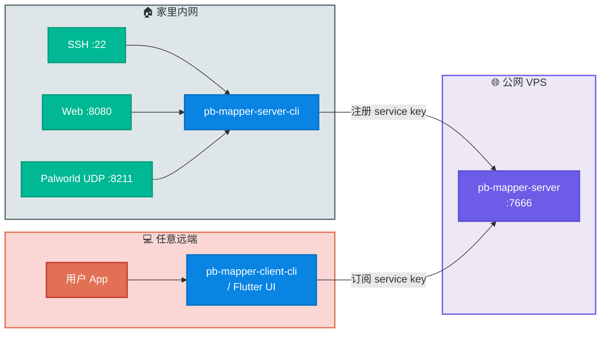

# 两年只为一件事：把公网穿透做成我每天离不开的工具

> 用 Rust 从零写的公网穿透工具。一根公网端口承载所有本地服务，CLI 能跑、Flutter UI 也能跑，部署还能让 AI Agent 帮你搞定。

## pb-mapper 是什么

[pb-mapper](https://github.com/acking-you/pb-mapper) 是我自己写的一套 TCP/UDP 公网穿透系统。

跟 frp 那种"一个服务占一个端口"的思路不同，pb-mapper 所有本地服务共用同一个公网端口，靠一个 **service key** 做注册和订阅。公网侧跑一个 `pb-mapper-server` 当会合点，维护服务注册表，负责双向流转发。

说人话就是：家里的网盘、编译机、UDP 游戏房、博客后端……想暴露几个就暴露几个，VPS 上只开 `7666` 一个端口，不用每加一个服务就去防火墙多放一行规则。



## 技术栈

- **语言和运行时**：Rust 2021 + Tokio 异步运行时
- **内存分配器**：自己 fork 的 [`better_mimalloc_rs`](https://github.com/acking-you/better_mimalloc_rs)，后面会细说为什么
- **网络抽象**：自研 [`uni-stream`](https://github.com/acking-you/uni-stream)，把 TCP 和 UDP 统一成一套流接口；底层用 `socket2` 控制 socket 选项，`trust-dns-resolver` 做 DNS
- **协议**：serde_json 序列化，自定义帧格式（checksum + 长度头），可选 `ring` 做 AES-256-GCM 端到端加密
- **连接管理**：V2 控制连接池 + 租约机制，不会因为一次 heartbeat 丢失就误判断开
- **GUI**：Flutter 前端，Rust 后端通过纯 C ABI FFI 暴露接口，`cdylib` + `staticlib` 双产物覆盖 Android/iOS/桌面

### 为什么 FFI 而不是跨语言框架

最早 UI 用的是 Rinf（一个 signal-based 的 Rust↔Flutter 桥接框架），用起来确实方便，但产物体积大、冷启动慢。后来索性切到裸 FFI——[`pb_mapper_ffi`](https://github.com/acking-you/pb-mapper/blob/master/ui/native/pb_mapper_ffi/src/lib.rs#L14) 直接暴露一组 C 函数，Flutter 侧 `dart:ffi` 调过来。APK 瘦了、启动快了、调试也直观了，代价是得自己管 handle 生命周期和 JSON 的跨语言编解码——但对我来说这点工作量完全可接受。

### 为什么要自己 fork mimalloc

这事儿是被线上问题逼出来的。

社区最活跃的那个 mimalloc Rust 封装（`mimalloc` crate），上游 mimalloc 的很多配置接口（`mi_option_set_*` 那一整套）压根没暴露到 Rust 层。更要命的是默认配置下 mimalloc 的内存回收策略非常懒——对短生命周期的程序无所谓，但对 pb-mapper 这种 7×24 挂机的服务进程就很不友好了。我在线上观察到的现象是：开了 mimalloc 之后进程 RSS 只涨不降，本来想省内存结果反而吃得更多。

所以我 fork 了一份，把需要的 option 全暴露出来，加了个 `config` feature，让你在声明 `#[global_allocator]` 的时候就能把 purge 策略、decommit 超时这些参数调成更积极的值。现在 pb-mapper 在我家服务器上长期挂机，RSS 一直稳定在一个很窄的区间，这个 allocator 层功不可没。

## 怎么用

公网服务端（`pb-mapper-server`）在 VPS 上部署一次，之后家里和外面随便哪台机器都能连。部署方式我留了三条路，挑适合你的就行。

### 方式一：AI Agent 一键部署

如果你在用 Claude Code、Cursor、Kiro 这类带 agent 能力的工具，仓库里自带两个部署 skill：

| Skill | 干什么 |
|---|---|
| `/pb-mapper-server-deploy` | 本地下载二进制 → SCP 传到 VPS → 写 systemd unit → 启动 |
| `/pb-mapper-client-cli-deploy` | 同样的流程，在任意 Linux 机器上起一条 client 隧道 |

全程交互式，会问你 SSH 信息、端口、加密 key。GitHub 下载不通的话会自动走代理兜底，远程主机不需要能访问 GitHub。

### 方式二：一条命令

VPS 能直连 GitHub 的话：

```bash
curl -fsSL https://raw.githubusercontent.com/acking-you/pb-mapper/master/scripts/install-server-github.sh | bash
```

装完默认监听 `7666`，开启 `--use-machine-msg-header-key`，密钥写到 `/var/lib/pb-mapper-server/msg_header_key`。client 侧 `export MSG_HEADER_KEY="$(cat /var/lib/pb-mapper-server/msg_header_key)"` 就能对上。

### 方式三：手动跑 CLI 或者用 Flutter UI

三个二进制，名字就是功能：

- `pb-mapper-server`：公网中继
- `pb-mapper-server-cli`：跑在本地服务那一侧，把 `127.0.0.1:xxx` 注册成一个 service key
- `pb-mapper-client-cli`：跑在使用方那一侧，订阅 service key，在本地开一个监听端口

举个例子——从咖啡店访问家里 `localhost:8080` 的 web 服务：

```bash
# VPS 上
pb-mapper-server --port 7666

# 家里
pb-mapper-server-cli --server <vps-ip>:7666 --key web --local 127.0.0.1:8080

# 咖啡店
pb-mapper-client-cli --server <vps-ip>:7666 --key web --local 127.0.0.1:3000
# 浏览器打开 http://localhost:3000 就能访问家里的 web 服务了
```

不想敲命令的话，`ui/` 目录下有完整的 Flutter 界面，启停服务端、注册订阅、实时状态、配置管理、日志查看全都有，桌面和手机都能跑。

## 这个项目怎么来的

时间回到两年多前，我还在读本科、写毕设。

那会儿人在学校，但真正要跑编译、跑模型的时候得用家里的台式机。第一反应是自部署 RustDesk，结果体验很糟糕——带 UI 的远程桌面在校园网下卡得不行，而我 90% 的场景其实只需要一个 SSH 终端，根本用不着图形界面。

于是转向公网穿透方案。frp 是第一个试的，用了一段时间之后几个问题一直让我不舒服：

1. 每加一个服务就要改配置、多开一个端口，管理成本随服务数量线性增长
2. 控制连接的断开判定太粗暴，heartbeat 丢一次就整条流断掉，家用网络稍微波动一下就得重连
3. 资源占用对一台长期挂着的小机器来说不算轻

想了想，干脆自己写一个。我脑子里的理想形态很清楚：**一个公网端口、一个 service key 注册表、控制连接用租约而不是心跳超时、TCP 和 UDP 共用同一套流抽象**。pb-mapper 的第一版就是这么来的。

之后两年多，它一直在被各种真实场景捶打。控制连接的租约逻辑改了好几轮（[`81ebe63`](https://github.com/acking-you/pb-mapper/commit/81ebe63)、[`82659fc`](https://github.com/acking-you/pb-mapper/commit/82659fc)、[`367bddd`](https://github.com/acking-you/pb-mapper/commit/367bddd) 这几个 commit 都是相关修复），UDP datagram 转发的边界情况也踩过不少坑（专门写了一篇 [复盘](https://github.com/acking-you/pb-mapper/blob/master/docs/udp-datagram-forwarding.md)）。每修一次，它就更稳一层。

到今天，它已经是我日常开发离不开的基础设施了。

## 实际跑了些什么

几个真实场景：

- **幻兽帕鲁**——火的那阵子，我把家里 Palworld 服务端的 UDP 8211 映射出去，和朋友们联机了好几周。延迟体感跟 frp 直映端口差不多。
- **[StaticFlow](https://acking-you.github.io)**——我自己基于 LanceDB 写的个人内容平台（带一个"许愿入库"的 agent 工具），跑在家里的服务器上，通过 pb-mapper 把后端 API 映射到公网，已经稳定运行三四个月了。
- **日常开发**——SSH、远程 VSCode、临时给朋友开个 HTTP 文件服务……全走同一个公网 `:7666` 端口。

性能方面，内存和 CPU 的资源消耗比 frp 更优——这点在长期挂机的场景下体感很明显。在保证单端口复用的服务注册订阅逻辑的前提下，转发延迟也没比 frp 那种一对一端口直映的方案差。如果你在意的是"一个进程能不能轻量地同时扛很多条隧道"，它应该能打。

## 链接

- 仓库：https://github.com/acking-you/pb-mapper
- 用户手册：https://github.com/acking-you/pb-mapper/blob/master/docs/user-guide.zh-CN.md
- Docker 部署：https://github.com/acking-you/pb-mapper/blob/master/DOCKER_README.md
- UDP 转发原理：https://github.com/acking-you/pb-mapper/blob/master/docs/udp-datagram-forwarding.md

有问题欢迎提 issue，两年多的打磨还在继续。
