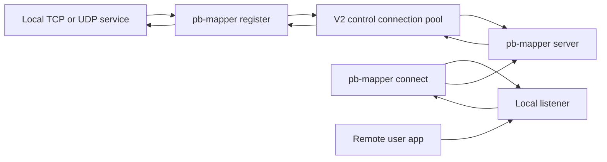
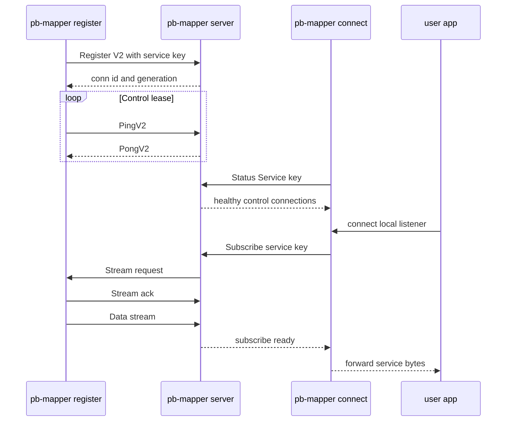

# pb-mapper User Guide

[English](user-guide.md) | [中文](user-guide.zh-CN.md)

## Overview

pb-mapper exposes local TCP/UDP services through a public relay using a service key. One `pb-mapper` binary provides the `server`, `register`, `connect`, and `status` commands, alongside an optional Flutter GUI.

## How it works



The `server` role is the public rendezvous point. A `register` process registers one service key and keeps a small pool of long-lived control connections to the relay. A `connect` process first checks that the requested service key has a healthy registered control connection, then opens a local listener for downstream users.

When a user connects to the connect-side local listener, that process subscribes to the service key. The relay selects a healthy registered control connection, asks the matching register process to open a data stream, waits for an acknowledgement, and then forwards bytes between the client stream and the local service.



Control connections are leased rather than guessed from a single missing heartbeat. If a register process stops receiving control-plane activity for longer than the tolerance window, it opens a separate status probe and verifies that the exact `conn_id` and `generation` are still present on the relay. If that registration is missing, or if the probe keeps failing past the suspect grace window, the process reconnects and registers a fresh control connection. The relay also expires idle V2 control connections, and subscribe requests skip unhealthy or stale registrations.

## Prerequisites

- Optional: Flutter SDK for the GUI (`ui/`)
- Optional: Docker/Compose for container deployment (see `DOCKER_README.md`)

## Install (recommended)

Download prebuilt binaries from GitHub Releases and extract them:

- Releases: https://github.com/acking-you/pb-mapper/releases

Each target has one archive, named `pb-mapper-<target>.tar.gz` on Unix-like systems or `pb-mapper-<target>.zip` on Windows. After extracting, add `pb-mapper` to your PATH or run it from the extracted folder.

## Build from source (optional)

### Rust binaries

Requires the Rust toolchain (see `rust-toolchain.toml` for the pinned version).

Build the Rust CLI:

```bash
cargo build --release
```

Build the CLI with Make:

```bash
make build-pb-mapper
```

Cross-build a musl CLI binary:

```bash
make build-pb-mapper-x86_64_musl
```

The binary is placed at `target/release/pb-mapper`.

### Flutter UI (optional)

```bash
cd ui
flutter run
```

## Run (CLI)

If you added the binaries to your PATH, use them directly. Otherwise, prefix with `./`.

### 1) Start the central server

```bash
pb-mapper server --port 7666
```

Optional flags:

- `--ipv6`: enable IPv6 listening
- `--keep-alive`: enable TCP keep-alive
- `--use-machine-msg-header-key`: derive `MSG_HEADER_KEY` from current machine hostname + MAC,
  and write it to `/var/lib/pb-mapper-server/msg_header_key`

### Machine-derived `MSG_HEADER_KEY` (optional)

When you want each deployed server to use a host-specific key (instead of the built-in default),
start server with:

```bash
pb-mapper server --port 7666 --use-machine-msg-header-key
```

This will:

- derive a stable 32-byte key from hostname + MAC addresses
- set server process `MSG_HEADER_KEY` automatically
- persist the key to `/var/lib/pb-mapper-server/msg_header_key`

Then use the same key for the `register` and `connect` commands:

```bash
export MSG_HEADER_KEY="$(cat /var/lib/pb-mapper-server/msg_header_key)"
pb-mapper register tcp --server "your-server:7666" --key "my-service" --addr "127.0.0.1:8080"
```

### 2) Register a local service

Register a TCP service:

```bash
pb-mapper register tcp \
  --server "your-server:7666" \
  --key "my-service" \
  --addr "127.0.0.1:8080"
```

Register a UDP service:

```bash
pb-mapper register udp \
  --server "your-server:7666" \
  --key "my-udp" \
  --addr "127.0.0.1:8211"
```

To enable optional AES-256-GCM message encryption for forwarded traffic, add `--codec` to the register command.

### 3) Connect from a remote client

```bash
pb-mapper connect tcp \
  --server "your-server:7666" \
  --key "my-service" \
  --addr "127.0.0.1:9090"
```

After step 3, the remote machine can access the service at `127.0.0.1:9090`.

### Status commands

```bash
pb-mapper status remote-id --server "your-server:7666"
pb-mapper status keys --server "your-server:7666"
```

## Run (GUI)

The Flutter UI can start the server, register services, and connect clients through a graphical workflow. Start it from `ui/`:

```bash
cd ui
flutter run
```

## Environment variables

- `PB_MAPPER_SERVER`: default server address for the CLI
- `PB_MAPPER_KEEP_ALIVE`: enable TCP keep-alive (set to `ON`)
- `PB_MAPPER_LOG_FORMAT`: tracing output format, one of `pretty` (default), `compact`, or `json`
- `PB_MAPPER_CONTROL_IO_TIMEOUT`: close stalled control-plane handshakes after this duration, default `30s`
- `PB_MAPPER_STREAM_ACK_TIMEOUT`: wait for a registered server control connection to acknowledge a stream request before trying another connection, default `300ms`
- `PB_MAPPER_STREAM_READY_TIMEOUT`: wait after a stream ack for the server-side data stream to arrive before trying another connection, default `1s`
- `PB_MAPPER_STREAM_RECOVERY_TIMEOUT`: keep a client subscribe open while stale control connections are retired and replacement control connections register, default `2s`
- `PB_MAPPER_CONTROL_CONN_POOL_SIZE`: number of parallel server-side control connections per registered service, default `2`, maximum `16`
- `PB_MAPPER_CONTROL_HEARTBEAT_INTERVAL`: interval between register-role control heartbeats, default `2s`
- `PB_MAPPER_CONTROL_HEARTBEAT_TOLERANCE`: how long a registered control connection may go without inbound control activity before it becomes suspect and is probed, default `6s`
- `PB_MAPPER_CONTROL_SUSPECT_GRACE`: additional grace after a failed remote registration probe before reconnecting, default `2s`
- `PB_MAPPER_REGISTRATION_PROBE_TIMEOUT`: timeout for each register-role remote registration status probe, default `1s`
- `PB_MAPPER_SERVER_LEASE_TIMEOUT`: server-side idle lease timeout for V2 registered control connections, default `15s`
- `PB_MAPPER_CLIENT_HEALTH_CHECK_INTERVAL`: how often the client-side local listener rechecks that the remote service key is still registered, default `15s`
- `PB_MAPPER_CLIENT_HEALTH_CHECK_TIMEOUT`: timeout for each client-side remote key health check, default `5s`
- `PB_MAPPER_CLIENT_HEALTH_FAILURE_THRESHOLD`: consecutive failed health checks required before restarting the client-side local listener, default `3`
- `PB_MAPPER_TUNNEL_IDLE_TIMEOUT`: close a fully idle TCP tunnel after this duration, default `1h`
- `PB_MAPPER_HALF_CLOSE_IDLE_TIMEOUT`: close a half-closed TCP tunnel after this idle duration, default `60s`
- `RUST_LOG`: logging level, for example `info` or `debug`

Timeout values accept plain seconds or `ms`/`s`/`m`/`h` suffixes, for example `500ms`, `60s`, `10m`, or `1h`.

## Docker deployment

For containerized deployment of the server, see [`DOCKER_README.md`](../DOCKER_README.md).
