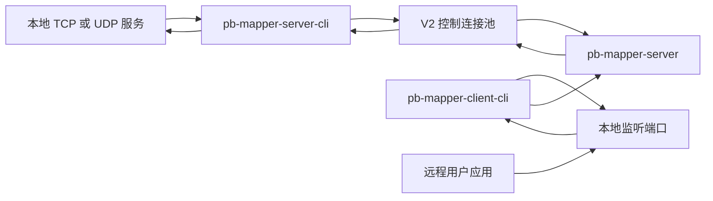
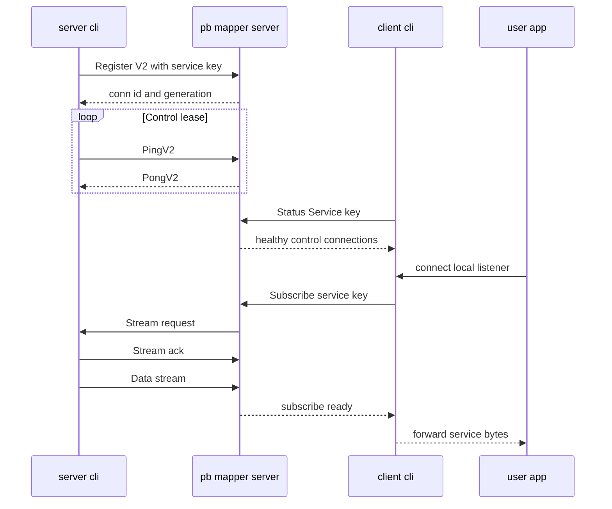

# pb-mapper 使用手册

[English](user-guide.md) | [中文](user-guide.zh-CN.md)

## 概览

pb-mapper 通过“服务 key”将本地 TCP/UDP 服务暴露到公网服务器，提供三款 CLI 二进制与可选的 Flutter GUI。

## 运转机制



`pb-mapper-server` 是公网会合点。`pb-mapper-server-cli` 为一个服务 key 注册本地服务，并向 server 保持一组长期存在的控制连接。`pb-mapper-client-cli` 在对外暴露本地监听端口前，会先确认目标服务 key 下面存在 healthy 的控制连接。

当用户连接 client 侧的本地监听端口时，client 会向 server 订阅目标服务 key。server 选择一个健康的已注册控制连接，让对应的 server-cli 打开数据流，等待 ack 后再把 client 数据流和本地服务之间的字节双向转发起来。



控制连接使用租约机制，而不是因为一次没收到 heartbeat 就直接误判断开。如果 server-cli 在容忍窗口内没有收到控制面入站消息，它会打开一条独立 status 探测连接，确认 server 注册表里是否还存在精确的 `conn_id` 和 `generation`。如果注册已经丢失，或探测失败超过 suspect 宽限窗口，server-cli 会主动重连并重新注册。server 侧也会回收空闲的 V2 控制连接，subscribe 选择连接时会跳过 unhealthy 或 stale 的注册。

## 环境准备

- 可选：Flutter SDK（用于 `ui/` 图形界面）
- 可选：Docker/Compose（容器部署见 `DOCKER_README.md`）

## 安装（推荐）

从 GitHub Releases 下载预编译二进制并解压：

- Releases：https://github.com/acking-you/pb-mapper/releases

每个二进制单独打包：

- `pb-mapper-server-<version>-<target>.tar.gz` / `.zip`
- `pb-mapper-server-cli-<version>-<target>.tar.gz` / `.zip`
- `pb-mapper-client-cli-<version>-<target>.tar.gz` / `.zip`

解压后添加到 PATH 或从解压目录直接运行。

## 从源码编译（可选）

### Rust 二进制

需要 Rust 工具链（版本以 `rust-toolchain.toml` 为准）。

编译所有 Rust 二进制：

```bash
cargo build --release
```

仅编译服务器（Makefile）：

```bash
make build-pb-mapper-server
```

交叉编译 musl 服务器：

```bash
make build-pb-mapper-server-x86_64_musl
```

二进制产物位于 `target/release/`（例如 `pb-mapper-server`）。

### Flutter UI（可选）

```bash
cd ui
flutter run
```

## 运行（CLI）

如已加入 PATH 可直接运行，否则前面加 `./`。

### 1）启动中心服务器

```bash
pb-mapper-server --pb-mapper-port 7666
```

可选参数：

- `--use-ipv6`：开启 IPv6 监听
- `--keep-alive`：开启 TCP keep-alive
- `--use-machine-msg-header-key`：基于当前机器 hostname + MAC 派生 `MSG_HEADER_KEY`，
  并写入 `/var/lib/pb-mapper-server/msg_header_key`

### 基于机器信息派生 `MSG_HEADER_KEY`（可选）

如果你希望每台部署机器都使用各自唯一的 key（而不是内置默认 key），可以这样启动服务端：

```bash
pb-mapper-server --pb-mapper-port 7666 --use-machine-msg-header-key
```

该参数会完成：

- 基于 hostname + MAC 地址派生稳定的 32 字节 key
- 自动设置当前服务端进程的 `MSG_HEADER_KEY`
- 将 key 持久化到 `/var/lib/pb-mapper-server/msg_header_key`

随后在 `pb-mapper-server-cli` / `pb-mapper-client-cli` 中使用同一 key：

```bash
export MSG_HEADER_KEY="$(cat /var/lib/pb-mapper-server/msg_header_key)"
pb-mapper-server-cli --pb-mapper-server "your-server:7666" tcp-server --key "my-service" --addr "127.0.0.1:8080"
```

### 2）注册本地服务

注册 TCP 服务：

```bash
pb-mapper-server-cli --pb-mapper-server "your-server:7666" \
  tcp-server \
  --key "my-service" \
  --addr "127.0.0.1:8080"
```

注册 UDP 服务：

```bash
pb-mapper-server-cli --pb-mapper-server "your-server:7666" \
  udp-server \
  --key "my-udp" \
  --addr "127.0.0.1:8211"
```

如需启用 AES-256-GCM 的转发消息加密，请在子命令之前加入 `--codec`（例如：`pb-mapper-server-cli --codec tcp-server ...`）。

### 3）远程客户端连接

```bash
pb-mapper-client-cli --pb-mapper-server "your-server:7666" \
  tcp-server \
  --key "my-service" \
  --addr "127.0.0.1:9090"
```

完成后，远程机器可通过 `127.0.0.1:9090` 访问目标服务。

### 状态命令

```bash
pb-mapper-server-cli --pb-mapper-server "your-server:7666" status remote-id
pb-mapper-server-cli --pb-mapper-server "your-server:7666" status keys
```

## 运行（GUI）

Flutter UI 可用于启动服务器、注册服务与建立连接。启动方式：

```bash
cd ui
flutter run
```

## 环境变量

- `PB_MAPPER_SERVER`：CLI 默认服务器地址
- `PB_MAPPER_KEEP_ALIVE`：启用 TCP keep-alive（设置为 `ON`）
- `PB_MAPPER_LOG_FORMAT`：tracing 输出格式，可选 `pretty`（默认）、`compact` 或 `json`
- `PB_MAPPER_CONTROL_IO_TIMEOUT`：控制面握手卡住后的关闭时间，默认 `30s`
- `PB_MAPPER_STREAM_ACK_TIMEOUT`：等待已注册服务控制连接确认 stream 请求的时间，超时后尝试其它控制连接，默认 `300ms`
- `PB_MAPPER_STREAM_READY_TIMEOUT`：收到 stream ack 后等待服务端数据流到达的时间，超时后尝试其它控制连接，默认 `1s`
- `PB_MAPPER_STREAM_RECOVERY_TIMEOUT`：退休旧控制连接并等待替代控制连接注册时，单个 subscribe 最多保持打开的时间，默认 `2s`
- `PB_MAPPER_CONTROL_CONN_POOL_SIZE`：每个注册服务并行保持的服务端控制连接数量，默认 `2`，最大 `16`
- `PB_MAPPER_CONTROL_HEARTBEAT_INTERVAL`：server-cli 控制连接心跳间隔，默认 `2s`
- `PB_MAPPER_CONTROL_HEARTBEAT_TOLERANCE`：已注册控制连接多久没有收到入站控制消息后进入 suspect 并触发远端注册探测，默认 `6s`
- `PB_MAPPER_CONTROL_SUSPECT_GRACE`：远端注册探测失败后的额外宽限时间，超过后主动重连，默认 `2s`
- `PB_MAPPER_REGISTRATION_PROBE_TIMEOUT`：server-cli 每次远端注册状态探测的超时时间，默认 `1s`
- `PB_MAPPER_SERVER_LEASE_TIMEOUT`：server 侧 V2 已注册控制连接的空闲租约超时，默认 `15s`
- `PB_MAPPER_CLIENT_HEALTH_CHECK_INTERVAL`：client 侧本地 listener 重新确认远端 service key 仍已注册的间隔，默认 `1s`
- `PB_MAPPER_CLIENT_HEALTH_CHECK_TIMEOUT`：client 侧每次远端 key 健康检查的超时时间，默认 `1s`
- `PB_MAPPER_TUNNEL_IDLE_TIMEOUT`：TCP 隧道双向完全空闲后的关闭时间，默认 `1h`
- `PB_MAPPER_HALF_CLOSE_IDLE_TIMEOUT`：TCP 隧道半关闭后另一方向无数据时的关闭时间，默认 `60s`
- `RUST_LOG`：日志级别，例如 `info` 或 `debug`

超时值支持纯秒数，也支持 `ms`/`s`/`m`/`h` 后缀，例如 `500ms`、`60s`、`10m`、`1h`。

## Docker 部署

服务器容器部署请见 [`DOCKER_README.md`](../DOCKER_README.md)。
