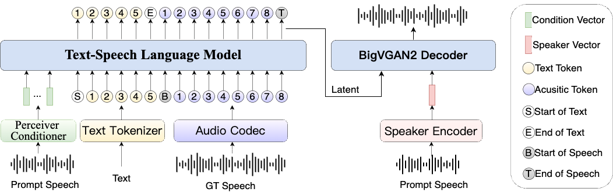

<div align="center">

</div>


<h2><center>IndexTTS: An Industrial-Level Controllable and Efficient Zero-Shot Text-To-Speech System</h2>

<p align="center">
<a href='https://arxiv.org/abs/2502.05512'></a>

## 👉🏻 IndexTTS 👈🏻

[[HuggingFace Demo]](https://huggingface.co/spaces/IndexTeam/IndexTTS)   [[ModelScope Demo]](https://modelscope.cn/studios/IndexTeam/IndexTTS-Demo) \
[[Paper]](https://arxiv.org/abs/2502.05512)  [[Demos]](https://index-tts.github.io)  

**IndexTTS** is a GPT-style text-to-speech (TTS) model mainly based on XTTS and Tortoise. It is capable of correcting the pronunciation of Chinese characters using pinyin and controlling pauses at any position through punctuation marks. We enhanced multiple modules of the system, including the improvement of speaker condition feature representation, and the integration of BigVGAN2 to optimize audio quality. Trained on tens of thousands of hours of data, our system achieves state-of-the-art performance, outperforming current popular TTS systems such as XTTS, CosyVoice2, Fish-Speech, and F5-TTS.
<span style="font-size:16px;">  
Experience **IndexTTS**: Please contact <u>xuanwu@bilibili.com</u> for more detailed information. </span>
### Contact
QQ群（二群）：1048202584 \
Discord：https://discord.gg/uT32E7KDmy  \
简历：indexspeech@bilibili.com  \
欢迎大家来交流讨论！
## 📣 Updates

- `2025/05/14` 🔥🔥 We release the **IndexTTS-1.5**, Significantly improve the model's stability and its performance in the English language.
- `2025/03/25` 🔥 We release IndexTTS-1.0 model parameters and inference code.
- `2025/02/12` 🔥 We submitted our paper on arXiv, and released our demos and test sets.

## 🖥️ Method

The overview of IndexTTS is shown as follows.

<picture>
  
</picture>


The main improvements and contributions are summarized as follows:
 - In Chinese scenarios, we have introduced a character-pinyin hybrid modeling approach. This allows for quick correction of mispronounced characters.
 - **IndexTTS** incorporate a conformer conditioning encoder and a BigVGAN2-based speechcode decoder. This improves training stability, voice timbre similarity, and sound quality.
 - We release all test sets here, including those for polysyllabic words, subjective and objective test sets.


## Model Download
| 🤗**HuggingFace**                                          | **ModelScope** |
|----------------------------------------------------------|----------------------------------------------------------|
| [IndexTTS](https://huggingface.co/IndexTeam/Index-TTS) | [IndexTTS](https://modelscope.cn/models/IndexTeam/Index-TTS) |
| [😁IndexTTS-1.5](https://huggingface.co/IndexTeam/IndexTTS-1.5) | [IndexTTS-1.5](https://modelscope.cn/models/IndexTeam/IndexTTS-1.5) |


## 📑 Evaluation

**Word Error Rate (WER) Results for IndexTTS and Baseline Models on the** [**seed-test**](https://github.com/BytedanceSpeech/seed-tts-eval)

| **WER**                | **test_zh** | **test_en** | **test_hard** |
|:----------------------:|:-----------:|:-----------:|:-------------:|
| **Human**              | 1.26        | 2.14        | -             |
| **SeedTTS**            | 1.002       | 1.945       | **6.243**     |
| **CosyVoice 2**        | 1.45        | 2.57        | 6.83          |
| **F5TTS**              | 1.56        | 1.83        | 8.67          |
| **FireRedTTS**         | 1.51        | 3.82        | 17.45         |
| **MaskGCT**            | 2.27        | 2.62        | 10.27         |
| **Spark-TTS**          | 1.2         | 1.98        | -             |
| **MegaTTS 3**          | 1.36        | 1.82        | -             |
| **IndexTTS**           | 0.937       | 1.936       | 6.831         |
| **IndexTTS-1.5**       | **0.821**   | **1.606**   | 6.565         |


**Word Error Rate (WER) Results for IndexTTS and Baseline Models on the other opensource test**


|    **Model**    | **aishell1_test** | **commonvoice_20_test_zh** | **commonvoice_20_test_en** | **librispeech_test_clean** |  **avg** |
|:---------------:|:-----------------:|:--------------------------:|:--------------------------:|:--------------------------:|:--------:|
|    **Human**    |        2.0        |            9.5             |            10.0            |            2.4             |   5.1    |
| **CosyVoice 2** |        1.8        |            9.1             |            7.3             |            4.9             |   5.9    |
|    **F5TTS**    |        3.9        |            11.7            |            5.4             |            7.8             |   8.2    |
|  **Fishspeech** |        2.4        |            11.4            |            8.8             |            8.0             |   8.3    |
|  **FireRedTTS** |        2.2        |            11.0            |            16.3            |            5.7             |   7.7    |
|     **XTTS**    |        3.0        |            11.4            |            7.1             |            3.5             |   6.0    |
|   **IndexTTS**  |      1.3          |          7.0               |            5.3             |          2.1             | 3.7       |
|   **IndexTTS-1.5**  |      **1.2**     |          **6.8**          |          **3.9**          |          **1.7**          | **3.1** |


**Speaker Similarity (SS) Results for IndexTTS and Baseline Models**

|    **Model**    | **aishell1_test** | **commonvoice_20_test_zh** | **commonvoice_20_test_en** | **librispeech_test_clean** |  **avg**  |
|:---------------:|:-----------------:|:--------------------------:|:--------------------------:|:--------------------------:|:---------:|
|    **Human**    |       0.846       |            0.809           |            0.820           |            0.858           |   0.836   |
| **CosyVoice 2** |     **0.796**     |            0.743           |            0.742           |          **0.837**         | **0.788** |
|    **F5TTS**    |       0.743       |          **0.747**         |            0.746           |            0.828           |   0.779   |
|  **Fishspeech** |       0.488       |            0.552           |            0.622           |            0.701           |   0.612   |
|  **FireRedTTS** |       0.579       |            0.593           |            0.587           |            0.698           |   0.631   |
|     **XTTS**    |       0.573       |            0.586           |            0.648           |            0.761           |   0.663   |
|   **IndexTTS**  |       0.744       |            0.742           |          **0.758**         |            0.823           |   0.776   |
|   **IndexTTS-1.5**  |       0.741       |            0.722           |          0.753         |            0.819           |   0.771   |


**MOS Scores for Zero-Shot Cloned Voice**

| **Model**       | **Prosody** | **Timbre** | **Quality** |  **AVG**  |
|-----------------|:-----------:|:----------:|:-----------:|:---------:|
| **CosyVoice 2** |    3.67     |    4.05    |    3.73     |   3.81    |
| **F5TTS**       |    3.56     |    3.88    |    3.56     |   3.66    |
| **Fishspeech**  |    3.40     |    3.63    |    3.69     |   3.57    |
| **FireRedTTS**  |    3.79     |    3.72    |    3.60     |   3.70    |
| **XTTS**        |    3.23     |    2.99    |    3.10     |   3.11    |
| **IndexTTS**    |    **3.79**     |    **4.20**    |    **4.05**     |   **4.01**    |


## Usage Instructions
### Environment Setup
1. Download this repository:
```bash
git clone https://github.com/index-tts/index-tts.git
```
2. Install dependencies:

Create a new conda environment and install dependencies:
 
```bash
conda create -n index-tts python=3.10
conda activate index-tts
apt-get install ffmpeg
# or use conda to install ffmpeg
conda install -c conda-forge ffmpeg
```

Install [PyTorch](https://pytorch.org/get-started/locally/), e.g.:
```bash
pip install torch torchaudio --index-url https://download.pytorch.org/whl/cu118
```

> [!NOTE]
> If you are using Windows you may encounter [an error](https://github.com/index-tts/index-tts/issues/61) when installing `pynini`:
`ERROR: Failed building wheel for pynini`
> In this case, please install `pynini` via `conda`:
> ```bash
> # after conda activate index-tts
> conda install -c conda-forge pynini==2.1.6
> pip install WeTextProcessing --no-deps
> ```

Install `IndexTTS` as a package:
```bash
cd index-tts
pip install -e .
```

3. Download models:

Download by `huggingface-cli`:

```bash
huggingface-cli download IndexTeam/IndexTTS-1.5 \
  config.yaml bigvgan_discriminator.pth bigvgan_generator.pth bpe.model dvae.pth gpt.pth unigram_12000.vocab \
  --local-dir checkpoints
```

Recommended for China users. 如果下载速度慢，可以使用镜像：
```bash
export HF_ENDPOINT="https://hf-mirror.com"
```

Or by `wget`:

```bash
wget https://huggingface.co/IndexTeam/IndexTTS-1.5/resolve/main/bigvgan_discriminator.pth -P checkpoints
wget https://huggingface.co/IndexTeam/IndexTTS-1.5/resolve/main/bigvgan_generator.pth -P checkpoints
wget https://huggingface.co/IndexTeam/IndexTTS-1.5/resolve/main/bpe.model -P checkpoints
wget https://huggingface.co/IndexTeam/IndexTTS-1.5/resolve/main/dvae.pth -P checkpoints
wget https://huggingface.co/IndexTeam/IndexTTS-1.5/resolve/main/gpt.pth -P checkpoints
wget https://huggingface.co/IndexTeam/IndexTTS-1.5/resolve/main/unigram_12000.vocab -P checkpoints
wget https://huggingface.co/IndexTeam/IndexTTS-1.5/resolve/main/config.yaml -P checkpoints
```

> [!NOTE]
> If you prefer to use the `IndexTTS-1.0` model, please replace `IndexTeam/IndexTTS-1.5` with `IndexTeam/IndexTTS` in the above commands.


4. Run test script:


```bash
# Please put your prompt audio in 'test_data' and rename it to 'input.wav'
python indextts/infer.py
```

5. Use as command line tool:

```bash
# Make sure pytorch has been installed before running this command
indextts "大家好，我现在正在bilibili 体验 ai 科技，说实话，来之前我绝对想不到！AI技术已经发展到这样匪夷所思的地步了！" \
  --voice reference_voice.wav \
  --model_dir checkpoints \
  --config checkpoints/config.yaml \
  --output output.wav
```

Use `--help` to see more options.
```bash
indextts --help
```

#### Web Demo
```bash
pip install -e ".[webui]" --no-build-isolation
python webui.py

# use another model version:
python webui.py --model_dir IndexTTS-1.5
```

Open your browser and visit `http://127.0.0.1:7860` to see the demo.


#### Sample Code
```python
from indextts.infer import IndexTTS
tts = IndexTTS(model_dir="checkpoints",cfg_path="checkpoints/config.yaml")
voice="reference_voice.wav"
text="大家好，我现在正在bilibili 体验 ai 科技，说实话，来之前我绝对想不到！AI技术已经发展到这样匪夷所思的地步了！比如说，现在正在说话的其实是B站为我现场复刻的数字分身，简直就是平行宇宙的另一个我了。如果大家也想体验更多深入的AIGC功能，可以访问 bilibili studio，相信我，你们也会吃惊的。"
tts.infer(voice, text, output_path)
```

## Acknowledge
1. [tortoise-tts](https://github.com/neonbjb/tortoise-tts)
2. [XTTSv2](https://github.com/coqui-ai/TTS)
3. [BigVGAN](https://github.com/NVIDIA/BigVGAN)
4. [wenet](https://github.com/wenet-e2e/wenet/tree/main)
5. [icefall](https://github.com/k2-fsa/icefall)

## 📚 Citation

🌟 If you find our work helpful, please leave us a star and cite our paper.

```
@article{deng2025indextts,
  title={IndexTTS: An Industrial-Level Controllable and Efficient Zero-Shot Text-To-Speech System},
  author={Wei Deng, Siyi Zhou, Jingchen Shu, Jinchao Wang, Lu Wang},
  journal={arXiv preprint arXiv:2502.05512},
  year={2025}
}
```
